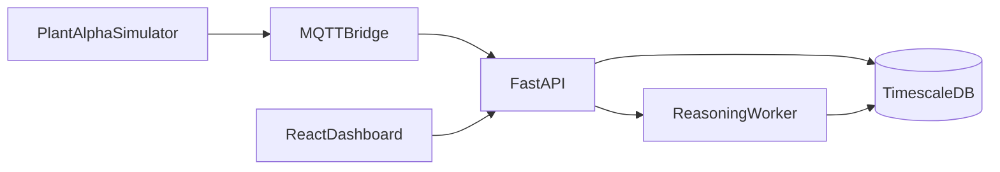

# ODIS

[](https://github.com/Saim-naushad/Odis/actions/workflows/backend.yml)
[](https://github.com/Saim-naushad/Odis/actions/workflows/frontend.yml)
[](https://github.com/Saim-naushad/Odis/actions/workflows/docker.yml)
[](LICENSE)
[](pyproject.toml)

ODIS is an industrial operational intelligence platform that turns telemetry from physical assets into explainable assessments and recommendations. It combines a deterministic reasoning engine, a deployable backend (ingestion, persistence, APIs), and an operator dashboard — demonstrated today on PEM fuel-cell scenarios. The platform is an actively developed MVP: real services, real data paths, not a hardened production deployment.

<p align="center">
  
</p>

*Fleet overview during an active cooling degradation incident.*

## What ODIS does

Industrial equipment produces continuous measurements — temperature, pressure, flow, voltage. Raw values are not decisions. ODIS separates **evidence**, **signals**, **assessments**, and **recommendations** into an append-only reasoning chain that operators can inspect, replay, and audit. The same pipeline runs as an importable Python library and as a live platform processing MQTT telemetry.



Telemetry flows from the simulator through MQTT into the API, persists in TimescaleDB, triggers reasoning in the worker, and surfaces assessments and recommendations to the dashboard over SSE.

## Key capabilities

- **Deterministic reasoning** — trend and variation detection, operational assessment, and prioritized recommendations with explicit justification; no opaque ML in the core pipeline
- **Explainable reasoning artifacts** — immutable snapshots for situations, decision contexts, plans, actions, and outcomes
- **Platform runtime** — FastAPI, background worker, TimescaleDB persistence, Redis cache, Kafka integration events, MQTT ingestion
- **Operator dashboard** — React monitoring console with fleet view, health scores, recommendations, timeline, telemetry history, and SSE updates
- **Plant Alpha demo** — physics-based fuel-cell simulator publishing realistic telemetry through the full stack
- **Domain profiles** — configurable operational knowledge (default educational profile and fuel-cell profile) without changing core detectors or planners
- **CLI and examples** — `odis demo` commands and executable walkthroughs for the reasoning engine in isolation

## Dashboard

The operator console surfaces fleet health, prioritized recommendations, live telemetry, and an investigation timeline — all driven by the reasoning worker in real time.

<p align="center">
  
</p>

*Telemetry correlated with operational reasoning.*

<p align="center">
  
</p>

*Reasoning timeline from evidence to recommendation.*

## Technology stack

| Layer | Technologies |
|-------|--------------|
| Reasoning engine | Python 3.11, deterministic pipeline, domain profiles |
| API & worker | FastAPI, SQLAlchemy, background job queue, Server-Sent Events |
| Data & messaging | TimescaleDB, Redis, Kafka, MQTT (Mosquitto) |
| Operator UI | React, TypeScript, Vite |
| Operations | Docker Compose, Prometheus, Grafana, Kubernetes |

## Repository map

| Path | Purpose |
|------|---------|
| [`src/`](src/) | Reasoning engine — domain model, detectors, assessors, planners, and the public `odis` package |
| [`backend/`](backend/) | Platform services — FastAPI API, worker, MQTT bridge, SQLAlchemy persistence, digital twin, and operational state |
| [`backend/simulator/`](backend/simulator/) | Plant Alpha telemetry simulator and fault scenarios for end-to-end demonstration |
| [`frontend/`](frontend/) | React + TypeScript operator monitoring dashboard |
| [`docs/`](docs/) | Architecture, platform, and onboarding documentation — start at [docs/README.md](docs/README.md) |
| [`k8s/`](k8s/) | Kubernetes manifests for platform deployment |
| [`infra/`](infra/) | Docker images, Prometheus, and Grafana provisioning |

## Two ways to explore ODIS

### A. Full platform (recommended)

Runs the complete stack: MQTT ingestion, TimescaleDB, reasoning worker, digital twin, and the monitoring dashboard. Plant Alpha publishes live telemetry so you can watch assessments and recommendations appear in the UI.

```bash
git clone https://github.com/Saim-naushad/Odis.git
cd Odis
docker compose --profile demo up --build -d
```

Open the monitoring console at `http://localhost:8080`. For the scripted demo walkthrough, validation, and architecture detail, see [Demo Environment](docs/platform/demo-environment.md).

### B. Lightweight reasoning library

Install the Python package and run demonstrations without Docker. Useful for understanding the reasoning pipeline in isolation.

```bash
git clone https://github.com/Saim-naushad/Odis.git
cd Odis
pip install -e ".[dev]"
odis demo all
```

For a guided first program and result interpretation, see [Quickstart](docs/quickstart.md).

## Quick start

**Requirements:** Python 3.11+ for library development; Docker for the full platform.

| Goal | Command | Docs |
|------|---------|------|
| Full platform + demo | `docker compose --profile demo up --build -d` | [Demo Environment](docs/platform/demo-environment.md) |
| Platform without demo profile | `docker compose up --build -d` | [Docker Runtime](docs/platform/docker-runtime.md) |
| Reasoning library | `pip install -e ".[dev]"` then `odis demo all` | [Quickstart](docs/quickstart.md) |
| Run tests | `pytest` | [Contributing](CONTRIBUTING.md) |

Configuration loads from `.env` (see `.env.example`).

## Documentation

| Topic | Entry point |
|-------|-------------|
| All documentation | [docs/README.md](docs/README.md) |
| 15-minute onboarding | [docs/quickstart.md](docs/quickstart.md) |
| Reasoning engine design | [docs/architecture.md](docs/architecture.md) |
| Pipeline stages | [docs/reasoning-pipeline.md](docs/reasoning-pipeline.md) |
| Platform deployment | [docs/platform/README.md](docs/platform/README.md) |
| Architecture diagrams | [docs/architecture-diagrams.md](docs/architecture-diagrams.md) |
| Contributing | [CONTRIBUTING.md](CONTRIBUTING.md) |

## Current limitations

ODIS is early-stage. The following reflect the implementation today:

- **MVP, not production-hardened** — no auth, multi-tenancy, or SLA guarantees; suitable for development, demonstration, and portfolio use
- **Reasoning scalability** — each job reloads full per-asset observation history; queue depth can grow on long demo sessions without bounded reasoning windows
- **Placeholder planning rules** — `DecisionPlanner` uses generic substring matching on assessment text; production policy engines are not integrated
- **Limited signal types** — trend and variation detection are implemented; anomaly and rate-of-change are not separate first-class signals yet
- **No closed-loop execution** — action and outcome records are persisted but not wired to external control systems
- **Demo asset metadata** — the four Plant Alpha assets resolve rich names, types, and locations from a static catalog; any other asset id falls back to a derived placeholder with no registry-backed identity
- **No OPC UA or SCADA connectors** — MQTT and HTTP ingestion are implemented; industrial protocol breadth is limited

## Contributing

See [CONTRIBUTING.md](CONTRIBUTING.md) for development setup, coding guidelines, and pull request expectations.

## License

MIT — see [LICENSE](LICENSE).
