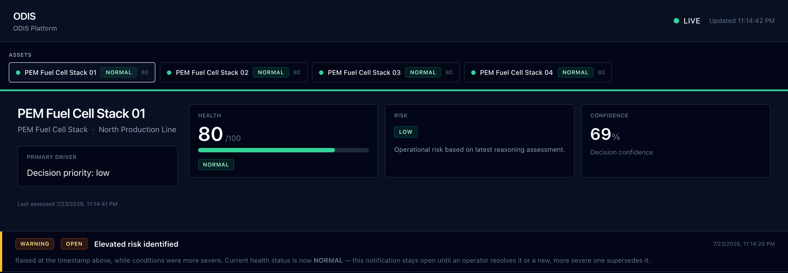
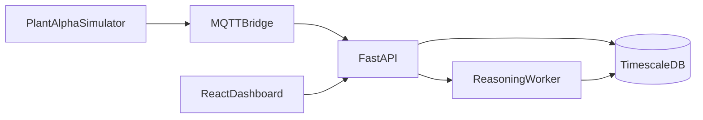
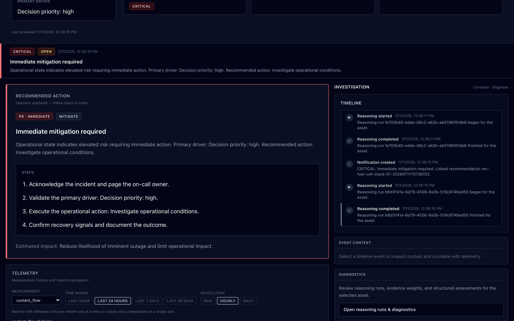
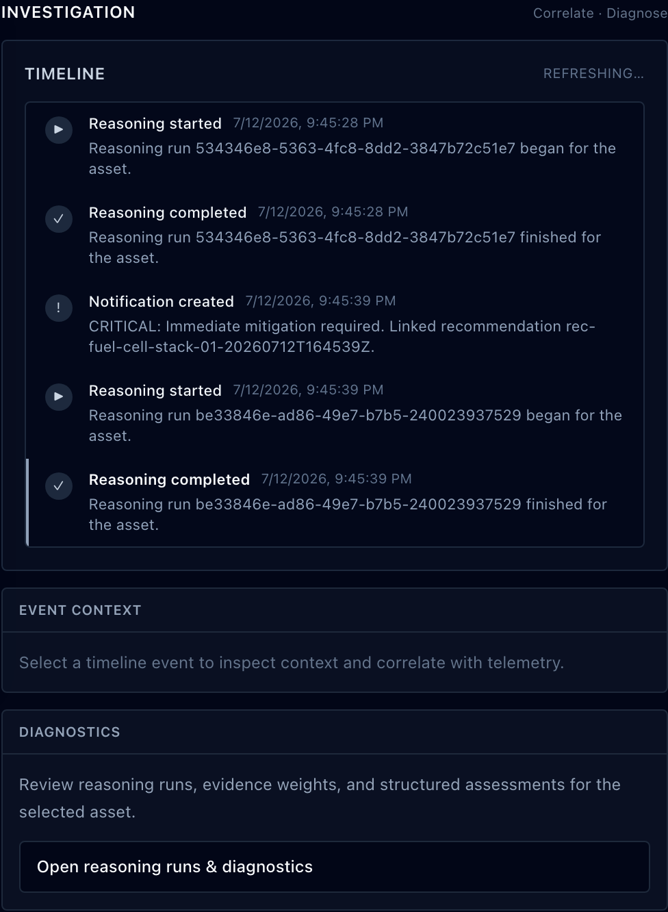
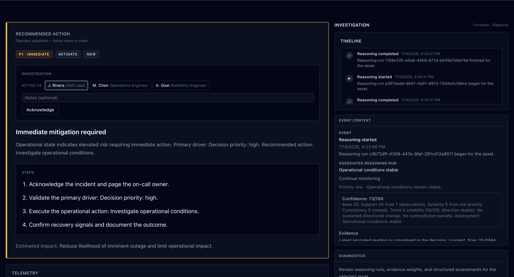

# ODIS

[](https://github.com/Saim-naushad/Odis/actions/workflows/backend.yml)
[](https://github.com/Saim-naushad/Odis/actions/workflows/frontend.yml)
[](https://github.com/Saim-naushad/Odis/actions/workflows/docker.yml)
[](LICENSE)
[](pyproject.toml)

ODIS is an industrial operations platform that turns telemetry from physical equipment into explainable operational decisions through a deterministic reasoning pipeline. Every recommendation is backed by inspectable evidence, a confidence score, and a complete reasoning trace. The platform is demonstrated end-to-end on a simulated PEM fuel-cell plant, while the reasoning engine itself remains domain-agnostic.

The repository contains both a standalone reasoning engine and a complete demonstration platform, including a physics-based simulator, an event-driven backend, and a live operator dashboard.


<p align="center">
  
</p>


## How it works



Telemetry flows from the simulator through MQTT into the API, persists in TimescaleDB, triggers reasoning in the background worker, and surfaces assessments and recommendations to the dashboard over Server-Sent Events.

**The reasoning engine itself doesn't know any of this infrastructure exists.** It is a standalone library that accepts observations and produces a reasoning result, invoked the same way from unit tests, example programs, or the production worker.

## The major systems

**Reasoning engine** (`src/`) — A seven-stage pipeline (Signal Extraction → Evidence → Hypothesis → Assessment → Confidence → Explanation → Planning) that runs identically whether called from a unit test or the production worker. The detectors intentionally favor deterministic, explainable algorithms over statistical black boxes so every recommendation can be verified by inspecting the underlying observations. See [docs/reasoning-pipeline.md](docs/reasoning-pipeline.md).

**Plant Alpha simulator** (`backend/simulator/`) — A four-stack PEM fuel-cell digital twin built on first-order-lag physics rather than random number generation. Cooling faults and hydrogen-supply faults propagate through the appropriate subsystems, producing realistic correlated telemetry instead of independent noise. The simulator publishes over MQTT exactly like a real industrial environment. See [docs/simulator.md](docs/simulator.md).

<br>

<p align="center">

  

</p>

<br>

**Event-driven backend** (`backend/app/`) — FastAPI and a background worker share one composition root. A transactional outbox guarantees domain events reach Kafka, while an in-process event bus drives cache invalidation and real-time dashboard updates without service polling.

**Digital twin** (`DigitalTwinService`) — A read model that assembles current asset state from monitoring data and forecasts. Cached in Redis and invalidated through domain events, it never re-executes reasoning that has already been performed.

**Investigation workflow** (`InvestigationService`) — Operator response to recommendations is stored as an append-only sequence of transitions (`ACKNOWLEDGED → INVESTIGATING → RESOLVED`) rather than a mutable status field, preserving a complete operational history. See [docs/platform/platform-architecture.md#operator-investigation-lifecycle](docs/platform/platform-architecture.md#operator-investigation-lifecycle).

<br>
<p align="center">
  
</p>
<br>

## Key capabilities

- **Deterministic reasoning** — Trend, variation, and correlation detectors produce explainable assessments with no hidden machine-learning models inside the reasoning pipeline.
- **Explainable recommendations** — Every recommendation traces back to the supporting evidence, generated hypothesis, confidence breakdown, and reasoning history.
- **Live operator dashboard** — A React monitoring console streams fleet health, telemetry, investigations, and recommendations over Server-Sent Events.
- **Investigation workflow** — Operator actions are captured as an append-only acknowledge → investigate → resolve lifecycle rather than overwriting previous state.
- **Event-driven architecture** — A transactional outbox and domain event bus decouple persistence from Kafka delivery, cache invalidation, and live UI updates.
- **Physics-based simulator** — Plant Alpha models a four-stack PEM fuel-cell plant with coupled subsystem behavior instead of synthetic random telemetry.

## Why ODIS exists

Industrial monitoring systems are good at collecting numbers and bad at explaining them. A temperature climbing for twenty minutes and a threshold alert firing are not the same thing as an operator understanding *why* it matters and *what to do about it*. Most systems either dump raw telemetry onto a dashboard and leave interpretation to a human, or wrap it inside a model whose reasoning cannot be inspected after the fact.

ODIS explores the middle ground: a deterministic sequence of reasoning stages that transforms observations into evidence, evidence into hypotheses, hypotheses into operational assessments, and assessments into actionable recommendations—while preserving every intermediate artifact along the way.

Nothing in the core reasoning pipeline relies on a trained model. Every recommendation can be traced directly back to the observations that produced it. That design choice is deliberate; see [CONTRIBUTING.md](CONTRIBUTING.md#philosophy) for the engineering principles behind it.

## Technology stack

| Layer | Technologies |
|-------|--------------|
| Reasoning engine | Python 3.11, deterministic reasoning pipeline, domain profiles |
| API & worker | FastAPI, SQLAlchemy, background workers, Server-Sent Events |
| Data & messaging | TimescaleDB, Redis, Kafka, MQTT (Mosquitto) |
| Operator UI | React, TypeScript, Vite |
| Operations | Docker Compose, Prometheus, Grafana, Kubernetes |

## Repository structure

| Path | Purpose |
|------|---------|
| [`src/`](src/) | Standalone reasoning engine — domain model, detectors, assessors, planners, and the public `odis` package |
| [`backend/`](backend/) | Platform services — FastAPI API, background worker, MQTT bridge, SQLAlchemy persistence, digital twin, and investigation workflow |
| [`backend/simulator/`](backend/simulator/) | Plant Alpha physics-based telemetry simulator and fault scenarios |
| [`frontend/`](frontend/) | React + TypeScript operator monitoring dashboard |
| [`docs/`](docs/) | Architecture, platform, onboarding, and design documentation — start at [docs/README.md](docs/README.md) |
| [`k8s/`](k8s/) | Kubernetes deployment manifests |
| [`infra/`](infra/) | Docker images, Prometheus, Grafana, and infrastructure provisioning |


## Quick start

ODIS can be explored in two different ways depending on what you're interested in.

### Full platform

Run the complete platform—including MQTT ingestion, TimescaleDB, the reasoning worker, digital twin, and the React operator dashboard—with the Plant Alpha simulator continuously publishing live telemetry.

```bash
git clone https://github.com/Saim-naushad/Odis.git
cd Odis
docker compose --profile demo up --build -d
```

Open the dashboard at:

```
http://localhost:8080
```
<br>

<p align="center">
  
</p>

<br>

For the complete walkthrough, expected simulator timeline, and validation steps, see the [Demo Environment Guide](docs/platform/demo-environment.md).

---

### Reasoning engine only

If you're interested only in the reasoning engine, you can run it without Docker.

```bash
git clone https://github.com/Saim-naushad/Odis.git
cd Odis
pip install -e ".[dev]"
odis demo all
```

For a guided introduction, see the [Quickstart](docs/quickstart.md).

**Requirements**

- Python 3.11+ for the standalone reasoning engine
- Docker Desktop (or Docker Engine + Compose) for the complete platform
- Configuration is loaded from `.env` (see `.env.example`)

---

## Documentation

| Topic | Entry point |
|-------|-------------|
| Documentation index | [docs/README.md](docs/README.md) |
| 15-minute onboarding | [docs/quickstart.md](docs/quickstart.md) |
| Architecture overview | [docs/architecture.md](docs/architecture.md) |
| Reasoning pipeline | [docs/reasoning-pipeline.md](docs/reasoning-pipeline.md) |
| Platform architecture | [docs/platform/README.md](docs/platform/README.md) |
| Simulator | [docs/simulator.md](docs/simulator.md) |
| Release notes | [RELEASE_NOTES.md](RELEASE_NOTES.md) |
| Contributing | [CONTRIBUTING.md](CONTRIBUTING.md) |

---

## Current limitations

ODIS intentionally prioritizes explainability and architectural clarity over production completeness. The following reflect deliberate scope boundaries in the current implementation.

- **MVP, not production-hardened** — Authentication, multi-tenancy, and operational SLAs are intentionally out of scope. The project is designed as an engineering demonstration and portfolio project.

- **Reasoning scalability** — Each reasoning job reloads the full observation history for an asset before windowing is applied. `ReasoningSessionConfig.observation_window` bounds detector input, but database retrieval itself is not yet windowed.

- **Planning policy** — `DecisionPlanner` currently derives recommendations from deterministic assessment rules. A richer policy engine is intentionally left for future work.

- **Single primary measurement per reasoning run** — Trend and variation detectors currently reason over one primary measurement type at a time. This makes certain orthogonal fault families (for example cooling vs. fuel-supply degradation) difficult to capture simultaneously. Multi-signal reasoning is the first planned architectural milestone after v1.0.

- **No closed-loop execution** — Actions and outcomes are persisted for traceability but are not connected to external industrial control systems.

- **Industrial protocol coverage** — MQTT and HTTP ingestion are implemented. Additional protocols such as OPC UA and SCADA integrations are intentionally outside the scope of v1.0.

---

## Contributing

Contributions are welcome.

See [CONTRIBUTING.md](CONTRIBUTING.md) for development setup, coding standards, testing expectations, and pull request guidelines.

---

## License

This project is released under the **MIT License**.

See [LICENSE](LICENSE) for details.