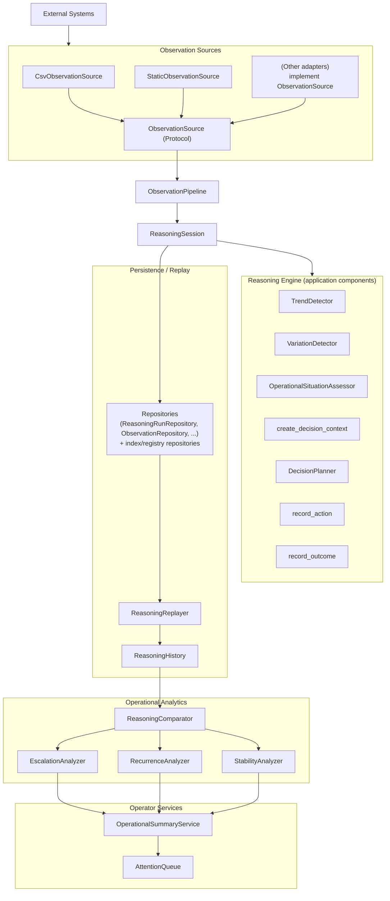
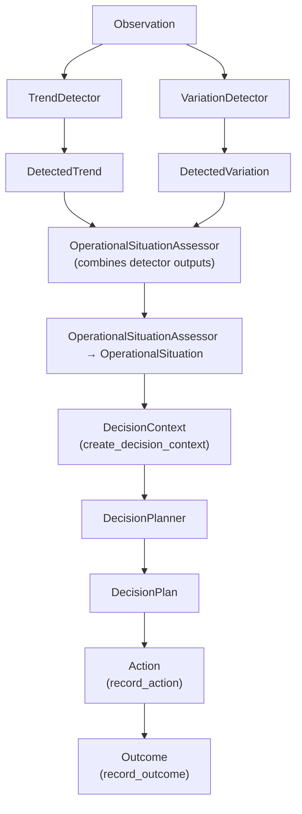
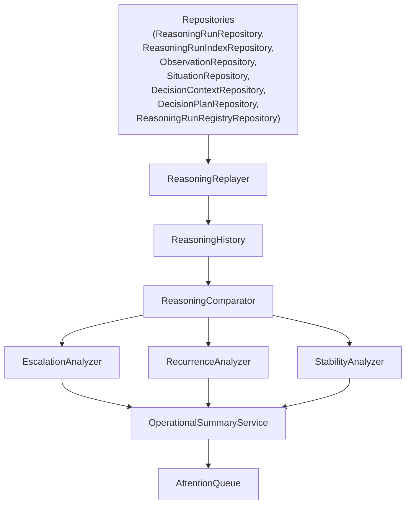
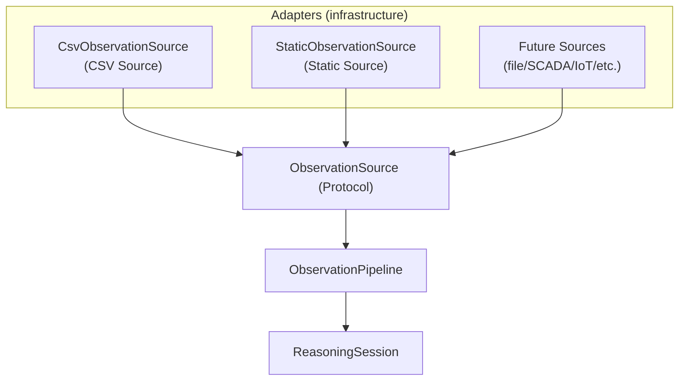

# Architecture diagrams

These diagrams document the **current** ODIS implementation (not proposed future architecture). They are intentionally high-signal and GitHub-readable.

## Diagram 1 — High-Level Architecture

## Diagram 2 — Reasoning Pipeline

## Diagram 3 — Replay & Analytics

## Diagram 4 — Integration Architecture

