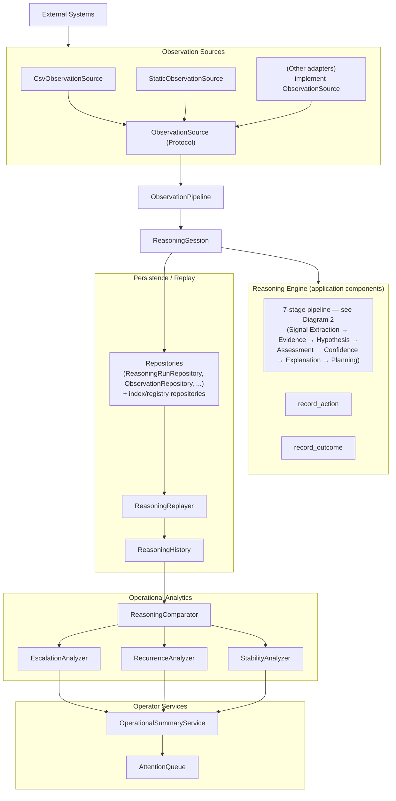
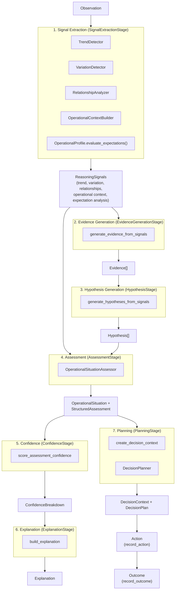
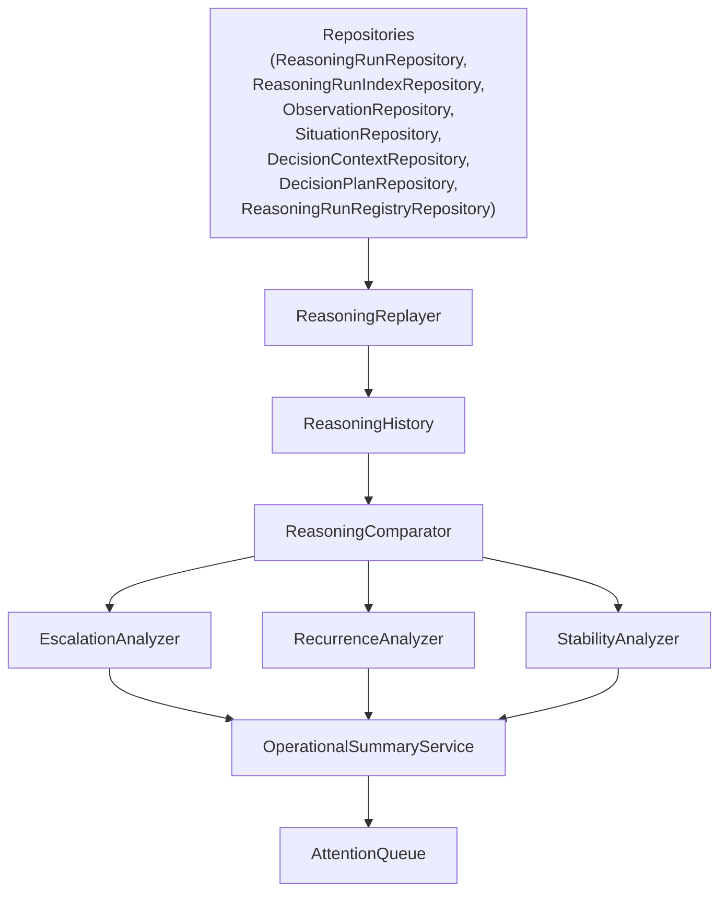
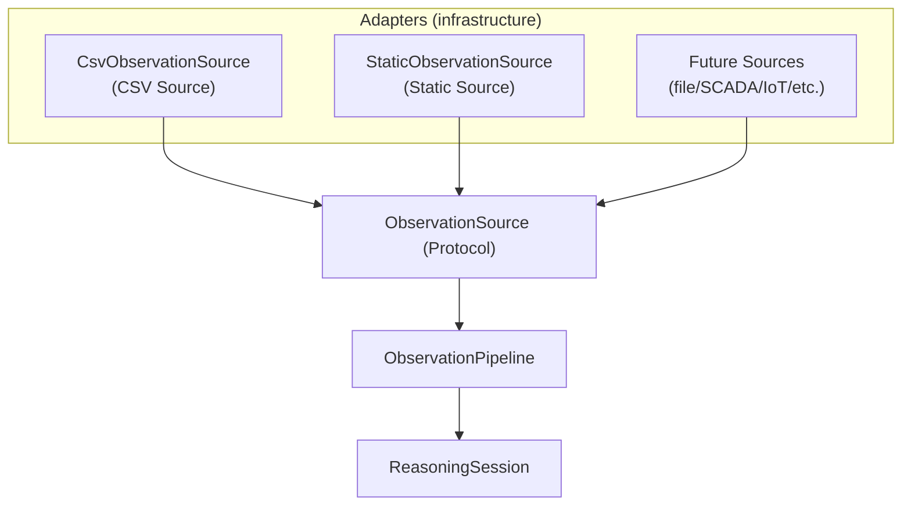

# Architecture diagrams

These diagrams document the **current** ODIS implementation (not proposed future architecture). They are intentionally high-signal and GitHub-readable.

## Diagram 1 — High-Level Architecture

## Diagram 2 — Reasoning Pipeline

`ReasoningSession.run()` executes seven `ReasoningStage` objects in order (`src/application/reasoning/`), each reading and extending a shared `ReasoningContext`:

`Action` and `Outcome` are recorded by `record_action`/`record_outcome` immediately after the stage loop, not as `ReasoningStage` objects. See [Reasoning Pipeline](reasoning-pipeline.md) for a stage-by-stage description of what each artifact represents and why it exists.

## Diagram 3 — Replay & Analytics

## Diagram 4 — Integration Architecture

