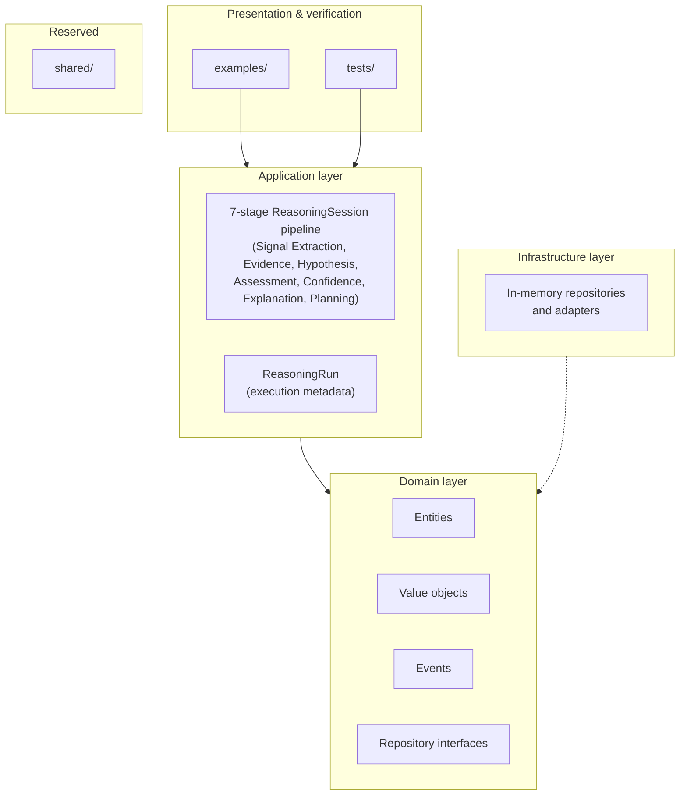
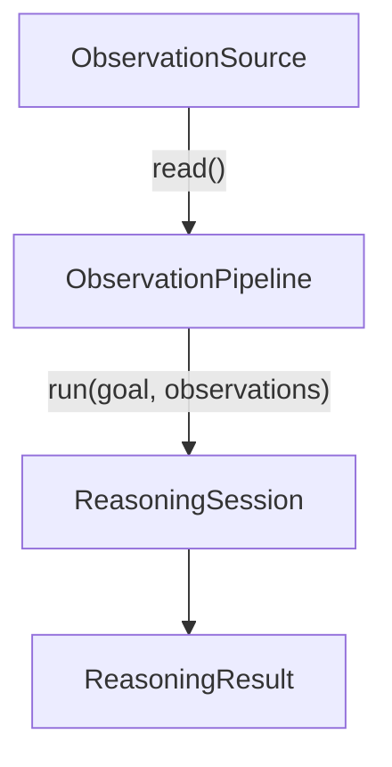
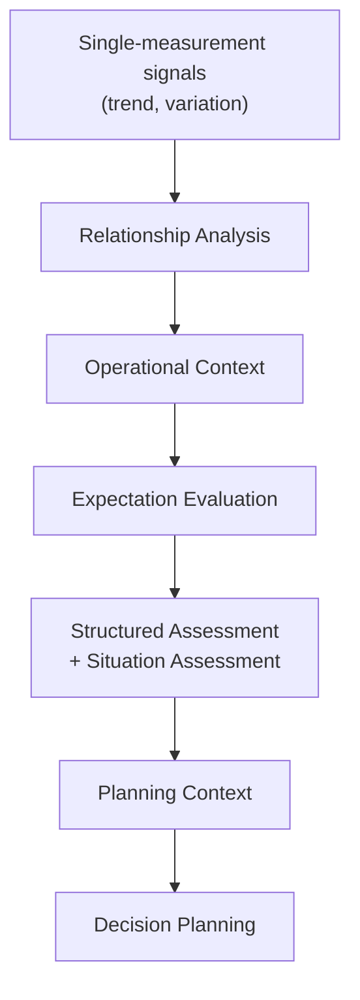

# ODIS Architecture

This document describes how the ODIS codebase is organized and the architectural principles that govern it. For installation and running demos, see the [README](../README.md).

## High-level view

ODIS follows a layered structure inspired by clean architecture. Dependencies point inward: application code orchestrates domain concepts; the domain knows nothing about detectors, planners, or examples.



The diagram reflects the current codebase. `shared/` remains a placeholder for cross-cutting utilities.

## Repository structure

```
Odis/
├── src/
│   ├── domain/           # Core model and contracts
│   ├── application/      # Use cases and reasoning components
│   ├── infrastructure/   # Repository implementations and future adapters
│   ├── shared/           # Reserved
│   └── main.py           # Entry point placeholder
├── examples/             # Executable operational walkthroughs
├── tests/                # Behavioral specifications
└── docs/                 # Architecture documentation
```

| Location | Purpose |
|----------|---------|
| `src/domain/` | Entities, value objects, events, and repository interfaces. The stable center of the system. |
| `src/application/` | Components that coordinate domain objects to perform operational reasoning. |
| `src/infrastructure/` | In-memory repository implementations, observation source adapters, and future integrations for persistence, messaging, and external systems. |
| `src/shared/` | Future home for utilities shared across layers without polluting the domain. |
| `examples/` | End-to-end demonstrations that wire application components together. |
| `tests/` | Unit and integration specifications; builders reduce test setup noise. |

## Domain layer

The domain layer defines **what operational reasoning means** in ODIS — not how it is stored, displayed, or triggered.

### Responsibilities

- **Entities** — immutable records with identity (`Asset`, `Observation`, `OperationalSituation`, `DecisionContext`, `DecisionPlan`, `Action`, `Outcome`, `OperationalGoal`)
- **Value objects** — immutable types defined by their attributes (`MeasurementType`, `Priority`, `TrendDirection`, `DetectedTrend`, and others)
- **Reasoning types** (`src/domain/reasoning/`) — `Evidence`, `Hypothesis`, `AssessmentSummary`, `ConfidenceBreakdown`, `Explanation`: the artifacts produced by the Evidence Generation, Hypothesis, Assessment, Confidence, and Explanation stages
- **Events** — contracts for facts that already happened (`ObservationRecorded`, `OperationalSituationCreated`, `DecisionContextCreated`, and others)
- **Repository interfaces** — abstract persistence contracts without implementation (including `ReasoningRunRepository` for execution metadata)
- **Structural invariants** — validation enforced in entity and value object constructors

### What the domain does not do

- Detect trends or produce recommendations
- Access databases, APIs, or the file system
- Import from the application or infrastructure layers

The domain is intentionally small. Business workflows live in the application layer; storage lives in infrastructure (when implemented).

## Application layer

The application layer defines **how operational reasoning is performed** by orchestrating domain objects.

### Current components

| Component | Role |
|-----------|------|
| `TrendDetector` | Derives a `DetectedTrend` signal from a homogeneous observation sequence |
| `VariationDetector` | Derives a `DetectedVariation` signal from a homogeneous observation sequence |
| `ObservationGroup` | Groups observations from one asset; builds a `MeasurementIndex` |
| `MeasurementIndex` | Lookup from `MeasurementType` to ordered observations within a group |
| `CorrelationDetector` | Detects cross-measurement correlations via composed trend detectors |
| `ContradictionDetector` | Flags predefined cross-measurement inconsistency candidates |
| `RelationshipAnalyzer` | Façade aggregating correlation and contradiction detectors into `RelationshipAnalysis` |
| `OperationalContextBuilder` | Standardizes construction of `OperationalContext` |
| `OperationalSituationAssessor` | Combines evidence, signals, relationships, and expectations into an `OperationalSituation` and `StructuredAssessment` |
| `create_decision_context` | Snapshots planner inputs as a `DecisionContext` |
| `DecisionPlanner` | Produces a `DecisionPlan` from a context |
| `PlanningContext` | Planning-relevant facts derived from `StructuredAssessment` |
| `SignalExtractionStage`, `EvidenceGenerationStage`, `HypothesisStage`, `AssessmentStage`, `ConfidenceStage`, `ExplanationStage`, `PlanningStage` | The seven `ReasoningStage` objects `ReasoningSession` executes in order; see [Reasoning Pipeline](reasoning-pipeline.md) |
| `ReasoningContext` | Immutable context threaded through and extended by each stage |
| `generate_evidence_from_signals` | Derives weighted `Evidence` from `ReasoningSignals` |
| `generate_hypotheses_from_signals` | Derives deterministic `Hypothesis` candidates from signals and evidence |
| `score_assessment_confidence` | Derives a deterministic `ConfidenceBreakdown` for an assessment |
| `build_explanation` | Derives a structured `Explanation` from assessment, evidence, hypotheses, and confidence |
| `ExpectationEvaluator` | Converts profile evidence decisions into `ExpectationEvaluation` outcomes |
| `ExpectationAnalysis` | Aggregates expectation evaluations for a run |
| `OperationalProfile` | Packages domain-specific policies and expectation evaluation |
| `create_operational_situation` | Lower-level situation construction without signal-based assessment |
| `ObservationPipeline` | Thin orchestration entry point for observation acquisition and reasoning execution |
| `MonitoringSession` | Coordinates multiple reasoning cycles over ordered observation snapshots |
| `MonitoringTimeline` | Immutable ordered sequence of `ReasoningResult` values from one monitoring session |
| `TimelineTrendAnalyzer` | Derives operational trajectory across completed monitoring cycles |
| `ReasoningSession` | Core orchestration engine from observations to outcome |
| `ReasoningRun` | Application metadata identifying a single execution (id, started_at) |

`ReasoningSession` optionally accepts repository interfaces. When configured, it persists domain records and the run itself as execution metadata before detectors execute. `ReasoningRun` is not a domain entity or event — it exists so executions have a durable identity for future replay and traceability.

`run()` is the core orchestration API: it accepts a goal and an observation sequence and executes the full pipeline. External integrations should target `ObservationPipeline`, which reads observations from an `ObservationSource` and delegates to `ReasoningSession.run()`. `ReasoningSession.run_from_source()` remains available as a convenience wrapper with identical behavior.

Each `ReasoningSession.run()` first persists run metadata and records observations (when repositories are configured), then executes seven `ReasoningStage` objects in a fixed order, each reading and extending a shared, immutable `ReasoningContext` (`src/application/reasoning/`):

1. **Signal Extraction** (`SignalExtractionStage`) — derives `DetectedTrend` and `DetectedVariation` from the **primary measurement type**; builds an `ObservationGroup` from all observations and runs `RelationshipAnalyzer`; builds `OperationalContext` via `OperationalContextBuilder`; evaluates expectations through the configured `OperationalProfile`. All five outputs are bundled into `ReasoningSignals`.
2. **Evidence Generation** (`EvidenceGenerationStage`) — derives a weighted `Evidence` tuple from `ReasoningSignals` (latest reading, trend, variation, recent delta, sample support, correlations, contradictions).
3. **Hypothesis Generation** (`HypothesisStage`) — derives 1–2 deterministic `Hypothesis` candidates (cooling degradation, hydrogen supply, sensor drift, load change, unknown) from signals and evidence.
4. **Assessment** (`AssessmentStage`) — wraps `OperationalSituationAssessor` to produce `OperationalSituation` and `StructuredAssessment`, bundled with the primary hypothesis and supporting evidence into an `AssessmentSummary`.
5. **Confidence** (`ConfidenceStage`) — scores a deterministic `ConfidenceBreakdown` from the assessment summary, evidence, hypotheses, and structured assessment.
6. **Explanation** (`ExplanationStage`) — builds a structured `Explanation` from the assessment summary, evidence, hypotheses, and confidence.
7. **Planning** (`PlanningStage`) — creates `DecisionContext` (via `create_decision_context`) and a `PlanningContext` from the structured assessment, then plans via `DecisionPlanner`, producing `DecisionPlan`.

`Action` and `Outcome` are recorded by `record_action`/`record_outcome` immediately after the stage loop finishes — they are not `ReasoningStage` objects.

When observations include multiple measurement types, single-measurement detectors use the first measurement type encountered; relationship analysis uses the full group. This lets profiles evaluate cross-measurement evidence without requiring every detector to accept heterogeneous sequences today.

#### Known limitation: single primary measurement per run

`TrendDetector` and `VariationDetector` run once per reasoning cycle, against one primary measurement type. This is sufficient when a domain's distinct fault conditions all manifest in the same channel, but insufficient when they don't: analysis on the Plant Alpha fuel-cell simulator found that a cooling-degradation fault and a hydrogen-supply fault are **physically orthogonal** — the former only ever shows up in `stack_temperature`, the latter only in `current`/`fuel_flow` — so no single fixed primary measurement can discriminate both. Forcing one profile-declared preference to serve every fault family the profile handles necessarily improves detection of one fault type at the expense of another.

Fixing this properly means either running detectors per measurement-type group and combining the results, or having `OperationalSituationAssessor`/`DecisionPlanner` reason over multiple signals instead of one — both cross into the assessment/planning coupling described in `CLAUDE.md` (assessment wording and the planner's text matching must change together) and are out of scope for an incremental calibration change. Multi-signal reasoning — detectors operating on multiple measurement-type groups per run, with assessment/planning able to consume more than one signal — is the first architectural milestone planned after v1.0, not something forced into this release. Until then, primary-measurement selection stays the existing deterministic "first measurement type encountered" behavior; see `primary_measurement_observations()` in `src/application/reasoning/context.py`.



`ObservationPipeline` is intentionally thin today — it performs no validation, preprocessing, enrichment, telemetry, or logging. Those concerns have a stable hook point here without duplicating pipeline logic inside `ReasoningSession`.

### Monitoring Session

`ReasoningSession` performs **one** full reasoning cycle over a single observation snapshot: observations in, result out.

`MonitoringSession` is an application-layer coordinator that performs **multiple** reasoning cycles over multiple snapshots, in order, by repeatedly invoking the existing `ObservationPipeline` — without polling, sleeping, scheduling, async, or background work.

Conceptually:

Snapshot 1 → Reason → Snapshot 2 → Reason → Snapshot 3 → Reason

This abstraction is the foundation for future continuous/streaming integrations: those systems can focus on how snapshots arrive over time while reusing the same per-snapshot reasoning pipeline unchanged.

#### Timeline vs. history vs. replay

Monitoring introduces an **ordered sequence of runs** produced within one `MonitoringSession`. These runs are represented by an immutable `MonitoringTimeline`.

This is intentionally distinct from other execution concepts:

- **Replay** reconstructs one reasoning execution from persisted artifacts.
- **History** lists persisted executions across time (a read API over the run registry and repositories).
- **Timeline** represents ordered monitoring cycles within a single monitoring session (newest/previous/count convenience, no persistence, no analytics).

#### Timeline Trend Analysis

`TimelineTrendAnalyzer` is an application-layer service that reasons over **completed operational decisions** across multiple reasoning cycles in a `MonitoringTimeline`. It derives a simple operational trajectory (improving, stable, worsening) by comparing priorities between the first and last cycle — intentionally ignoring intermediate cycles for now.

This is complementary to per-cycle telemetry reasoning:

- **`TrendDetector`** analyzes telemetry *within one reasoning cycle* (a single observation sequence).
- **`TimelineTrendAnalyzer`** analyzes operational evolution *across multiple reasoning cycles* (multiple completed decisions over time).

### Observation groups

`ObservationGroup` groups observations from a single asset and builds a `MeasurementIndex` for cross-measurement reasoning. `ReasoningSession` always constructs a group from the full observation set passed to `run()`.

Single-measurement detectors (`TrendDetector`, `VariationDetector`, and the assessor's primary signal path) operate on observations of the **primary measurement type** — the type of the first observation in the sequence. Relationship detectors operate on the full group, enabling profile-defined cross-measurement analysis when multiple types are present.

### Operational Profile

ODIS core remains **domain-agnostic**: the application layer defines reasoning mechanics and orchestration without embedding equipment-specific assumptions into detectors, assessors, or planners.

An `OperationalProfile` is the application-layer abstraction that packages **domain-specific operational knowledge** and exposes it to the reasoning engine as a set of policies. Profiles are immutable and are passed at the application entry points (for example, `MonitoringSession`) so the same reasoning pipeline can be reused across domains by swapping profiles rather than rewriting core logic.

The first capability exposed by profiles is the **relationship policy**: which cross-measurement relationships should be evaluated. Future planning policies and scenario policies may also belong to profiles as the system grows.

#### Correlation detectors

Correlation detectors reason across multiple measurement types by composing existing single-measurement detectors (for example, deriving a temperature trend and a pressure trend using `TrendDetector`, then comparing the results to emit a deterministic relationship).

Relationship policies define **which measurement relationships are evaluated** (for example, which measurement pairs should be checked for correlation or contradiction). Detectors define **how those relationships are evaluated** (for example, comparing trend directions and emitting a deterministic description). This keeps domain-specific operational knowledge configurable without embedding equipment-specific assumptions directly into detector logic.

#### Contradiction detectors

Contradiction detectors also compose single-measurement signals (for example, temperature and pressure trends), but they serve a different purpose:

- **Correlation** describes an observed relationship between measurements.
- **Contradiction** flags predefined combinations that appear operationally inconsistent and deserve additional review in context.

In this educational project, a contradiction is not a statement that a combination is physically impossible or universally bad — it is simply a deterministic rule that highlights an investigation candidate.

#### Relationship Analysis

`RelationshipAnalyzer` is an application-layer façade that aggregates multiple cross-measurement detectors into a single immutable `RelationshipAnalysis` result. It composes the existing `CorrelationDetector` and `ContradictionDetector` without duplicating their logic or interpreting their outputs, giving future operational assessment a single abstraction for cross-measurement reasoning rather than depending on individual detector types.

`OperationalSituationAssessor` can optionally consume a precomputed `RelationshipAnalysis` as an **enrichment layer** over its existing single-measurement trend/variation mapping. When provided, the assessor appends relationship-related language to the assessment text while leaving priority, planning, decision context construction, and replay behavior unchanged. When omitted, the assessor behaves exactly as before.

`ReasoningSession` now performs relationship analysis on each run and passes the result to the assessor and expectation-evaluation stage.



Relationship analysis and operational context are independent inputs to expectation evaluation. `OperationalSituationAssessor` consumes signals, relationship facts, and expectation results together when building `StructuredAssessment` and the domain `OperationalSituation`.

#### Structured Assessment

`OperationalSituation` remains the domain snapshot: an immutable record that captures **what the system believed** about the operational state at a point in time, including the human-readable `assessment` text consumed by today’s placeholder planner.

`StructuredAssessment` is an application-layer abstraction that provides a **machine-readable representation of the same evidence** already available during assessment (trend direction, variation level, whether cross-measurement correlations or contradictions were detected, and whether any expectations were unexpected or indeterminate). It adds no new reasoning, priorities, or recommendations, and it does not change the assessment text. This structured form exists to support future planners and analytics without rewriting the domain model.

#### Planning Context

`StructuredAssessment` describes operational reasoning: detector outputs and relationship facts that explain **what was observed** and **how it was assessed**.

`PlanningContext` is derived from `StructuredAssessment` and exposes only **planning-relevant facts** needed at the boundary between operational reasoning and decision planning (for example, whether any cross-measurement relationships or contradictions exist). It intentionally contains no priorities, recommendations, investigation flags, policy, or additional reasoning.

`DecisionPlanner` consumes an optional `PlanningContext`, but it currently **ignores it completely**. This is a dependency injection point: future planning policies can evolve behind `PlanningContext` without coupling the planner directly to detector outputs or changing operational assessment behavior.

#### Measurement Index

`MeasurementIndex` is an application-layer helper that organizes an `ObservationGroup` into a lookup map from `MeasurementType` to the ordered observations of that type. This enables future detectors to efficiently access grouped temperature, pressure, vibration, flow, and other measurements **without changing the domain model** (`Observation` remains a simple immutable record).

#### Expectation

`Expectation` is an immutable application-layer value object that captures a **qualitative engineering statement** — for example, "Cooling tracks load" or "Fuel flow follows current demand". Each expectation has a human-readable `name` and a `description` that explains what should hold in normal operation.

Expectations belong to **operational profiles**: profiles package domain-specific operational knowledge alongside relationship policies. The default profile evaluates no expectations; domain profiles such as `FuelCellOperationalProfile` may supply representative expectations and evaluation logic.

`ExpectationPolicy` and `OperationalScenario` define how expectations are selected by operating phase. They are value objects today and are not yet used to drive profile evaluation — scenario-based selection is deferred to the industrial platform phase.

#### Expectation Evaluation

Operational profiles determine whether evidence satisfies an expectation. A profile inspects available operational evidence — for example, whether declared cross-measurement relationships were detected — and decides if that evidence meets the expectation. `ExpectationEvaluator` standardizes the result: it converts a deterministic boolean decision into an `ExpectationEvaluation` with one of three outcomes — **expected**, **unexpected**, or **indeterminate** — and a fixed explanation for each.

`FuelCellExpectationEvaluator` is the first profile-driven bridge: it consumes `RelationshipAnalysis` and maps that evidence to the generic evaluator (`satisfied=True`, `satisfied=False`, or `satisfied=None`) without heuristics, thresholds, or detector logic. `ReasoningSession` delegates expectation evaluation to `OperationalProfile.evaluate_expectations()`, threading `OperationalContext` and `RelationshipAnalysis` into the profile. The default profile returns an empty `ExpectationAnalysis`; `FuelCellOperationalProfile` demonstrates representative evaluation.

#### Expectation Analysis

`ExpectationAnalysis` aggregates individual `ExpectationEvaluation` results into a single immutable snapshot of expectation reasoning. It exposes deterministic counts and flags — how many expectations were expected, unexpected, or indeterminate — derived purely from the evaluation tuple.

Expectation reasoning is part of the reasoning pipeline: each `ReasoningSession` run attaches an `ExpectationAnalysis` to `ReasoningResult`, and the corresponding flags flow into `StructuredAssessment` before `PlanningContext` is derived. The default profile contributes no evaluations; domain profiles may. This object carries no profile knowledge, detector logic, or evaluator logic.

#### Operational State

`OperationalState` is an immutable application-layer value object that represents a **candidate operational condition** identified by the reasoning engine — for example, "Normal Operation", "Possible Flooding", or "Thermal Stress". Each state has a human-readable `name` and a `description` that explains what condition is being considered.

Operational states are **derived from reasoning**: they express what the engine believes may be happening, not raw telemetry. They are distinct from **observations** (what was measured) and from **expectations** (what should hold in normal operation). In future, operational states will become input to hypothesis refinement; they are not wired into the pipeline today.

#### Hypothesis

A `Hypothesis` represents a **candidate explanation** supported by evidence. Each hypothesis references an `OperationalState` and includes a concise, human-readable rationale explaining why the hypothesis currently exists.

Multiple hypotheses may coexist at once: operational evidence can support more than one plausible explanation.

#### Hypothesis Refinement

Hypothesis refinement eliminates **inconsistent** candidate explanations as additional evidence is considered. Given a set of candidate hypotheses and a predicate describing whether each remains consistent with available evidence, refinement returns only the surviving hypotheses.

Refinement is deterministic: given the same hypotheses and the same evidence predicate, it always produces the same survivors, in the same ordering. This preserves explainability: each elimination is attributable to a specific inconsistency rule rather than a hidden scoring or ranking system.

Refinement may leave **multiple** surviving hypotheses. It does not force a single diagnosis; it narrows the candidate set to those that remain consistent with what is currently known.

#### Operational Context

`OperationalContext` is an immutable application-layer value object that describes the **operational situation** in which reasoning occurs — a human-readable `description` plus an optional `operating_mode` and `objective` (for example, "Steady-state operation under increasing load", `steady_state`, `maximize_power`).

Context is distinct from **observations** (what was measured) and from **expectations** (what should hold in normal operation): it captures the situational frame in which both are interpreted. It contains no logic. `ReasoningSession` now creates an `OperationalContext` on each run via `OperationalContextBuilder` and threads it through the pipeline into expectation evaluation; context inference remains intentionally minimal.

#### Operational Context Builder

`OperationalContextBuilder` is responsible for constructing `OperationalContext` instances. `ReasoningSession` uses it to produce the operational context for each run. Future implementations may derive context from evidence; the current builder is intentionally minimal and simply standardizes creation without inference, profile logic, or parsing.

#### Operational Scenario

`OperationalScenario` is an immutable application-layer value object that represents the **operating phase** of an asset — for example, startup, shutdown, steady-state, idle, or load-following. Each scenario has a human-readable `name` and a `description` that explains what phase is in effect.

Scenarios provide context for **expectation selection**: the same telemetry may be interpreted differently depending on whether the asset is starting up, following load, or holding steady. Scenarios belong to **operational profiles** rather than the framework; profiles define the phases relevant to their domain rather than relying on a fixed catalog.

Future expectation policies will evaluate behavior relative to scenarios so that declared expectations apply to the operating phase in which observations are interpreted.

#### Expectation Policy

`ExpectationPolicy` is an immutable application-layer value object that maps an `OperationalScenario` to the `Expectation` values relevant under that scenario. It belongs to **operational profiles**, which define which expectations apply in each operating phase.

The policy does not evaluate expectations, detect scenarios, or participate in profile evaluation today. Future platform integration will use it to select applicable expectations before evaluation.

### Runs vs. the run registry

Two complementary responsibilities keep execution metadata organized:

- **`ReasoningRunRepository`** stores individual runs — the full metadata for a single execution, keyed by run id.
- **`ReasoningRunRegistry`** catalogs all known executions. Each `ReasoningRunRegistryEntry` records only `run_id` and `started_at`, in insertion order. The registry is not a replay mechanism or a query engine; it simply records which executions exist so future historical browsing and replay have a stable starting point. When a registry is configured, `ReasoningSession` adds an entry immediately after creating (and optionally persisting) the run.

### Registry, history, and replay

These three concerns are intentionally separate:

- **Registry** — the catalog of known executions (`run_id`, `started_at`), in insertion order.
- **`ReasoningHistory`** — a read API over that catalog. It walks registry entries and loads the corresponding persisted run for each; it does not filter, search, paginate, or replay.
- **Replay** — reconstruction of one execution from its persisted artifacts (observations, situation, context, plan, and related records).

Keeping cataloging, listing, and reconstruction apart lets each evolve independently — for example, a future query layer can sit on top of history without entangling it with replay logic.

### Operational summary

`OperationalSummaryService` is a read-side composition service for operators. It assembles a single `OperationalSummary` for a run by replaying persisted artifacts and delegating to existing analytics — recurrence, escalation, and stability analysis. It does not perform new reasoning, persist data, or duplicate replay or analysis logic; it orchestrates `ReasoningReplayer`, `ReasoningHistory`, and the analyzer services into one operator-friendly view.

`AttentionQueue` is the first operator-oriented prioritization service built on operational summary. It ranks reasoning runs by a transparent, deterministic attention score derived from priority, recurrence, and escalation — reusing `OperationalSummaryService` and `ReasoningHistory` without duplicating replay or analytics logic.

### Reasoning trace

`ReasoningTrace` is a **presentation artifact** attached to each `ReasoningResult`. It is an ordered, immutable list of `TraceStep` records — a name and a one-sentence description — that explains how a reasoning session progressed through its stages (observations loaded, trend and variation detected, situation assessed, context created, plan produced, action and outcome recorded).

The trace exists for demos, debugging, and future visualization. It is deterministic and presentation-friendly, and is intentionally distinct from other concerns: it does not duplicate domain **events**, it does not replace **replay** (reconstruction from persisted artifacts), and it carries no timestamps, ids, or mutable state. It is simply a structured explanation of the reasoning flow, not a log or an event stream.

### Observation sources

`ObservationSource` is the application-layer boundary where external telemetry enters ODIS. It defines a minimal `read()` contract that returns an immutable tuple of observations — no streaming, async, callbacks, or session coupling. Integrations implement this interface in infrastructure; `ObservationPipeline` is the preferred application entry point that consumes it and hands observations to `ReasoningSession`.

`StaticObservationSource` holds a fixed sequence copied at construction and returns the same tuple on every `read()`. Use it in tests and demos.

`CsvObservationSource` is the first concrete integration adapter: it reads observations from a CSV file on each `read()` call and demonstrates how infrastructure implements `ObservationSource` for external telemetry (files today; MQTT, Kafka, OPC UA, and similar sources later).

Application components may validate input coherence (e.g., observations must share an asset) but should not embed domain invariants that belong on entities.

### What the application layer does not do

- Require persistence (repositories are optional)
- Ingest live telemetry
- Dispatch domain events (event types exist; no bus is wired)

Each component is replaceable. `VariationDetector` sits beside `TrendDetector` without changing entity definitions. `TimelineTrendAnalyzer` is a standalone consumer of `MonitoringTimeline` — monitoring sessions build timelines but do not analyze them automatically.

## Examples

The `examples/` directory contains executable walkthroughs, not production services. Each demo constructs synthetic data and runs the same application pipeline used in tests.

Examples exist to make the reasoning chain **visible**. They validate architectural reuse: heatwave, stable, and oscillating scenarios all call the same components with different inputs.

## Tests

Tests are organized to mirror the codebase:

```
tests/
├── builders.py           # Reusable domain object construction
├── application/          # Component behavioral specifications
└── integration/          # End-to-end pipeline specifications
```

Tests describe **contracts**, not implementation details. Builders express intent (`build_observation_sequence([32, 35, 38])`) so specifications remain readable as the system grows.

## Design principles

### Immutability

All domain entities and value objects are frozen after creation. A revised understanding — a new assessment, a changed goal definition, an updated interpretation — is recorded as a **new record**, not an mutation of an existing one.

This makes reasoning auditable: you can always answer what the system believed at a specific point in time.

### Append-only history

ODIS never rewrites operational history. Observations accumulate. Situations, contexts, and plans are snapshots appended to the record. Replay means reconstructing the chain from stored snapshots, not replaying mutations.

### Separation of concerns

Four concepts remain distinct throughout the pipeline:

| Concept | Question it answers |
|---------|---------------------|
| Evidence | What was measured? |
| Signal | What pattern was detected? |
| Assessment | What does it mean operationally? |
| Decision | What should be done? |

Collapsing these into a single object would simplify short-term code but erode traceability and make it harder to introduce new signal types or planning strategies.

## Dependency rules

1. **Domain** imports nothing from other ODIS layers.
2. **Application** imports domain only.
3. **Infrastructure** implements domain repository interfaces (including in-memory stores for domain entities and reasoning runs).
4. **Examples and tests** import application and domain; they are not imported by production layers.

This keeps the core model stable as adapters and integrations are added.

## Related documentation

- [Reasoning pipeline](reasoning-pipeline.md) — stage-by-stage flow from observation to outcome
- [README](../README.md) — project overview and getting started
