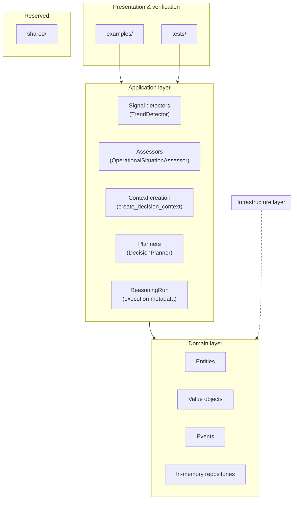

# ODIS Architecture

This document describes how the ODIS codebase is organized and the architectural principles that govern it. For installation and running demos, see the [README](../README.md).

## High-level view

ODIS follows a layered structure inspired by clean architecture. Dependencies point inward: application code orchestrates domain concepts; the domain knows nothing about detectors, planners, or examples.



The diagram reflects the current codebase. `shared/` remains a placeholder for cross-cutting utilities.

## Repository structure

```
Odis/
├── src/
│   ├── domain/           # Core model and contracts
│   ├── application/      # Use cases and reasoning components
│   ├── infrastructure/   # Repository implementations and future adapters
│   ├── shared/           # Reserved
│   └── main.py           # Entry point placeholder
├── examples/             # Executable operational walkthroughs
├── tests/                # Behavioral specifications
└── docs/                 # Architecture documentation
```

| Location | Purpose |
|----------|---------|
| `src/domain/` | Entities, value objects, events, and repository interfaces. The stable center of the system. |
| `src/application/` | Components that coordinate domain objects to perform operational reasoning. |
| `src/infrastructure/` | Append-only repository implementations and future adapters for persistence, messaging, and external systems. |
| `src/shared/` | Future home for utilities shared across layers without polluting the domain. |
| `examples/` | End-to-end demonstrations that wire application components together. |
| `tests/` | Unit and integration specifications; builders reduce test setup noise. |

## Domain layer

The domain layer defines **what operational reasoning means** in ODIS — not how it is stored, displayed, or triggered.

### Responsibilities

- **Entities** — immutable records with identity (`Asset`, `Observation`, `OperationalSituation`, `DecisionContext`, `DecisionPlan`, `Action`, `Outcome`, `OperationalGoal`)
- **Value objects** — immutable types defined by their attributes (`MeasurementType`, `Priority`, `TrendDirection`, `DetectedTrend`, and others)
- **Events** — contracts for facts that already happened (`ObservationRecorded`, `OperationalSituationCreated`, `DecisionContextCreated`, and others)
- **Repository interfaces** — abstract persistence contracts without implementation (including `ReasoningRunRepository` for execution metadata)
- **Structural invariants** — validation enforced in entity and value object constructors

### What the domain does not do

- Detect trends or produce recommendations
- Access databases, APIs, or the file system
- Import from the application or infrastructure layers

The domain is intentionally small. Business workflows live in the application layer; storage lives in infrastructure (when implemented).

## Application layer

The application layer defines **how operational reasoning is performed** by orchestrating domain objects.

### Current components

| Component | Role |
|-----------|------|
| `TrendDetector` | Derives a `DetectedTrend` signal from an observation sequence |
| `OperationalSituationAssessor` | Combines evidence, signal, and goal into an `OperationalSituation` |
| `create_decision_context` | Snapshots planner inputs as a `DecisionContext` |
| `DecisionPlanner` | Produces a `DecisionPlan` from a context |
| `create_operational_situation` | Lower-level situation construction without signal-based assessment |
| `ReasoningSession` | Orchestrates the full pipeline from observations to outcome |
| `ReasoningRun` | Application metadata identifying a single execution (id, started_at) |

`ReasoningSession` optionally accepts repository interfaces. When configured, it persists domain records and the run itself as execution metadata before detectors execute. `ReasoningRun` is not a domain entity or event — it exists so executions have a durable identity for future replay and traceability.

### Runs vs. the run registry

Two complementary responsibilities keep execution metadata organized:

- **`ReasoningRunRepository`** stores individual runs — the full metadata for a single execution, keyed by run id.
- **`ReasoningRunRegistry`** catalogs all known executions. Each `ReasoningRunRegistryEntry` records only `run_id` and `started_at`, in insertion order. The registry is not a replay mechanism or a query engine; it simply records which executions exist so future historical browsing and replay have a stable starting point. When a registry is configured, `ReasoningSession` adds an entry immediately after creating (and optionally persisting) the run.

Application components may validate input coherence (e.g., observations must share an asset) but should not embed domain invariants that belong on entities.

### What the application layer does not do

- Require persistence (repositories are optional)
- Ingest live telemetry
- Dispatch domain events (event types exist; no bus is wired)

Each component is replaceable. A future `VariationDetector` can sit beside `TrendDetector` without changing entity definitions.

## Examples

The `examples/` directory contains executable walkthroughs, not production services. Each demo constructs synthetic data and runs the same application pipeline used in tests.

Examples exist to make the reasoning chain **visible**. They validate architectural reuse: heatwave, stable, and oscillating scenarios all call the same components with different inputs.

## Tests

Tests are organized to mirror the codebase:

```
tests/
├── builders.py           # Reusable domain object construction
├── application/          # Component behavioral specifications
└── integration/          # End-to-end pipeline specifications
```

Tests describe **contracts**, not implementation details. Builders express intent (`build_observation_sequence([32, 35, 38])`) so specifications remain readable as the system grows.

## Design principles

### Immutability

All domain entities and value objects are frozen after creation. A revised understanding — a new assessment, a changed goal definition, an updated interpretation — is recorded as a **new record**, not an mutation of an existing one.

This makes reasoning auditable: you can always answer what the system believed at a specific point in time.

### Append-only history

ODIS never rewrites operational history. Observations accumulate. Situations, contexts, and plans are snapshots appended to the record. Replay means reconstructing the chain from stored snapshots, not replaying mutations.

### Separation of concerns

Four concepts remain distinct throughout the pipeline:

| Concept | Question it answers |
|---------|---------------------|
| Evidence | What was measured? |
| Signal | What pattern was detected? |
| Assessment | What does it mean operationally? |
| Decision | What should be done? |

Collapsing these into a single object would simplify short-term code but erode traceability and make it harder to introduce new signal types or planning strategies.

## Dependency rules

1. **Domain** imports nothing from other ODIS layers.
2. **Application** imports domain only.
3. **Infrastructure** implements domain repository interfaces (including in-memory stores for domain entities and reasoning runs).
4. **Examples and tests** import application and domain; they are not imported by production layers.

This keeps the core model stable as adapters and integrations are added.

## Related documentation

- [Reasoning pipeline](reasoning-pipeline.md) — stage-by-stage flow from observation to outcome
- [README](../README.md) — project overview and getting started
