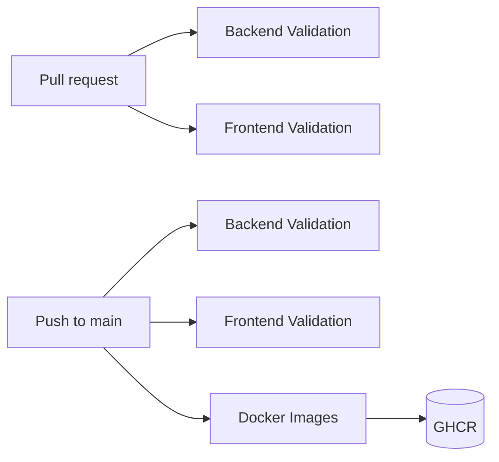

# CI/CD and Container Registry

This document describes the GitHub Actions workflows that validate ODIS and publish production Docker images to GitHub Container Registry (GHCR).

For runtime topology, see [Docker Runtime](docker-runtime.md). For Kubernetes deployment, see [Kubernetes Deployment](kubernetes-deployment.md).

---

## Workflow overview

| Workflow | File | Triggers | Purpose |
|----------|------|----------|---------|
| **Backend Validation** | `.github/workflows/backend.yml` | Pull requests, pushes to `main` | Ruff, MyPy, Pytest |
| **Frontend Validation** | `.github/workflows/frontend.yml` | Pull requests, pushes to `main` | `npm ci`, lint, production build |
| **Docker Images** | `.github/workflows/docker.yml` | Pushes to `main` only | Build and publish `api`, `worker`, and `frontend` images to GHCR |

Validation workflows run on every pull request and every push to `main`. Docker builds and registry publishing run only when changes land on `main`. No workflow deploys to Kubernetes or any cloud environment.



---

## Required GitHub configuration

### Permissions

The **Docker Images** workflow needs `packages: write` so `GITHUB_TOKEN` can push to GHCR. This is declared in the workflow file; no extra repository setting is required for public repositories.

For **private** repositories, ensure **Settings → Actions → General → Workflow permissions** allows read access to repository contents (default). The built-in `GITHUB_TOKEN` is sufficient for publishing to GHCR in the same organization or user account.

### Secrets

No custom secrets are required for the default setup.

| Secret / token | Required | Purpose |
|----------------|----------|---------|
| `GITHUB_TOKEN` | Automatic | GHCR login and image push (provided by GitHub Actions) |

Optional secrets (not used by current workflows):

| Secret | When needed |
|--------|-------------|
| `GHCR_TOKEN` | Only if you publish from an external runner or a different account; use a PAT with `write:packages` |

### Package visibility

After the first successful `main` push, images appear under the repository owner's GitHub Packages tab. Adjust visibility (public/private) under **Package settings** if needed.

---

## GHCR image names

Images are published under the repository owner (lowercased automatically by the metadata action). Do not hardcode usernames in manifests or docs — substitute your GitHub owner:

| Service | Image |
|---------|-------|
| API | `ghcr.io/<owner>/odis-api` |
| Worker | `ghcr.io/<owner>/odis-worker` |
| Frontend | `ghcr.io/<owner>/odis-frontend` |

Example for owner `acme-corp`:

```
ghcr.io/acme-corp/odis-api:latest
ghcr.io/acme-corp/odis-worker:1.0.0
ghcr.io/acme-corp/odis-frontend:abc1234
```

Dockerfiles live at:

- `infra/docker/api/Dockerfile`
- `infra/docker/worker/Dockerfile`
- `frontend/Dockerfile`

---

## Image versioning and tags

Each successful push to `main` applies three tag types to every image:

| Tag | Source | Example |
|-----|--------|---------|
| `latest` | Default rolling tag for `main` | `ghcr.io/<owner>/odis-api:latest` |
| Semver | `version` in `pyproject.toml` | `ghcr.io/<owner>/odis-api:1.0.0` |
| Git SHA | Short commit SHA | `ghcr.io/<owner>/odis-api:abc1234` |

Bump `version` in `pyproject.toml` before release-aligned merges to keep semver tags meaningful. The `latest` tag always tracks the most recent `main` build.

Pull requests do not produce or publish images.

---

## Publishing process

1. Open a pull request — **Backend Validation** and **Frontend Validation** run automatically.
2. Merge to `main` after checks pass — validation runs again, then **Docker Images** builds and pushes all three images to GHCR.
3. Pull images in your environment:

```bash
docker pull ghcr.io/<owner>/odis-api:latest
docker pull ghcr.io/<owner>/odis-worker:latest
docker pull ghcr.io/<owner>/odis-frontend:latest
```

For private packages, authenticate first:

```bash
echo "$GITHUB_TOKEN" | docker login ghcr.io -u <github-username> --password-stdin
```

---

## Caching strategy

| Layer | Mechanism | Scope |
|-------|-----------|-------|
| Python dependencies | `actions/setup-python` pip cache keyed on `pyproject.toml` | Backend Validation |
| npm dependencies | `actions/setup-node` npm cache keyed on `frontend/package-lock.json` | Frontend Validation |
| Docker build layers | Buildx GHA cache (`cache-from` / `cache-to`) per image (`odis-api`, `odis-worker`, `odis-frontend`) | Docker Images |

Concurrency groups cancel superseded runs on the same branch to keep CI fast when commits arrive in quick succession.

---

## Local parity

Run the same checks locally before pushing:

```bash
# Backend
pip install -e ".[dev]"
ruff check .
mypy src backend tests
pytest

# Frontend
npm --prefix frontend ci
npm --prefix frontend run lint
npm --prefix frontend run build
```

Docker builds (optional, local only):

```bash
docker build -f infra/docker/api/Dockerfile -t odis-api .
docker build -f infra/docker/worker/Dockerfile -t odis-worker .
docker build -f frontend/Dockerfile -t odis-frontend .
```
