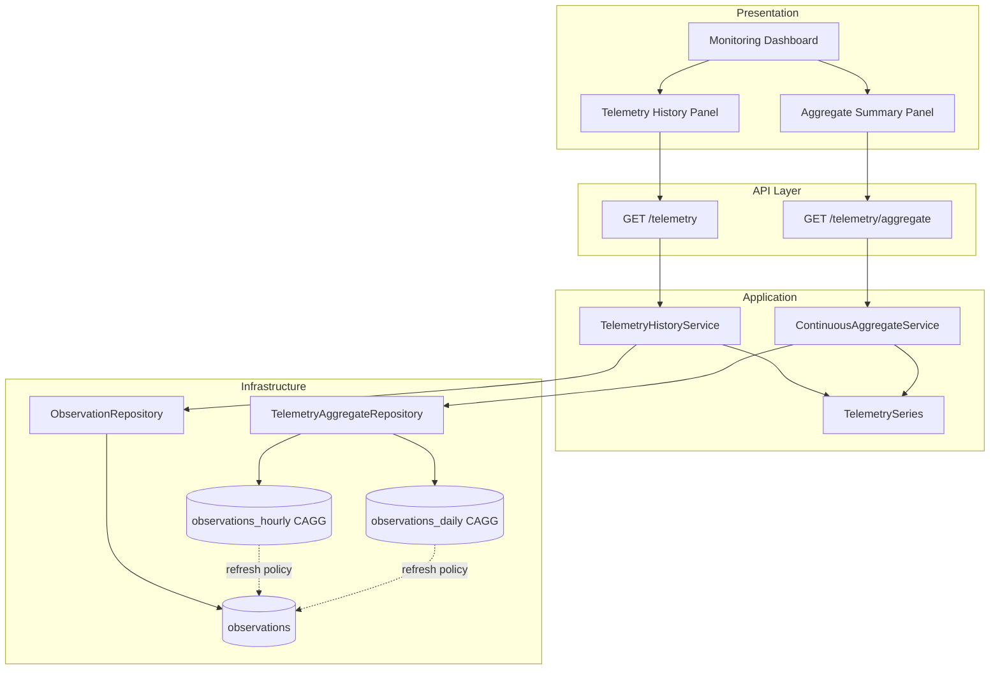
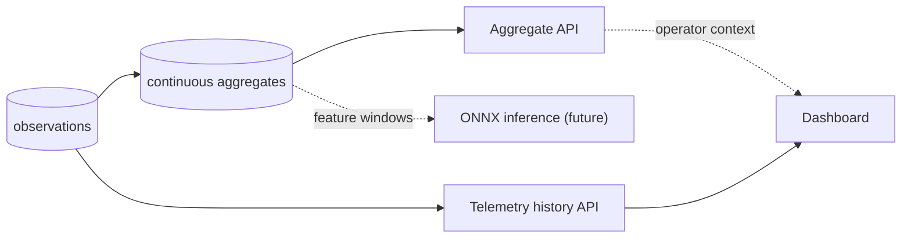

# Continuous Aggregates

This document describes how ODIS introduces TimescaleDB continuous aggregates for efficient historical telemetry analytics. It builds on the [TimescaleDB Foundation](timescaledb-foundation.md) and complements [Historical Telemetry APIs](telemetry-history.md).

For platform context, see [Platform Architecture](platform-architecture.md).

---

## Why Continuous Aggregates Exist

Raw `observations` rows are ideal for drill-down and reasoning, but expensive for dashboard-scale history. Scanning millions of rows to compute hourly or daily averages on every request does not scale as ingest volume grows.

TimescaleDB **continuous aggregates** are materialized views that pre-compute `time_bucket()` rollups. They:

- Store downsampled buckets in dedicated hypertables
- Refresh incrementally when underlying data changes
- Support **real-time aggregation** so recent (not-yet-materialized) buckets are merged at query time

ODIS keeps the domain `Observation` model unchanged. Aggregates are an infrastructure optimization behind a database-agnostic application service.

---

## Continuous Aggregate Definitions

Two rollups cover operator-facing summaries:

| View | Bucket | Aggregates |
|------|--------|------------|
| `observations_hourly` | `time_bucket('1 hour', timestamp)` | `avg`, `min`, `max`, `count`, `last(unit, timestamp)` |
| `observations_daily` | `time_bucket('1 day', timestamp)` | same |

Both views group by `(bucket, asset_id, measurement_type_name)` and are created with:

- `WITH NO DATA` — avoids an expensive initial full refresh during migration
- `timescaledb.materialized_only = false` — enables real-time aggregation for the latest incomplete bucket

Example definition (hourly):

```sql
CREATE MATERIALIZED VIEW observations_hourly
WITH (timescaledb.continuous, timescaledb.materialized_only = false) AS
SELECT
    time_bucket('1 hour', "timestamp") AS bucket,
    asset_id,
    measurement_type_name,
    avg(value) AS avg_value,
    min(value) AS min_value,
    max(value) AS max_value,
    count(*) AS sample_count,
    last(unit, "timestamp") AS unit
FROM observations
GROUP BY bucket, asset_id, measurement_type_name
WITH NO DATA;
```

Indexes on `(asset_id, measurement_type_name, bucket DESC)` match the repository query pattern.

The existing `observations` hypertable is **not modified** by this migration.

---

## Refresh Policies and Refresh Lag

Automated refresh policies keep materialized buckets current without rescanning the full hypertable on every run.

| View | `start_offset` | `end_offset` | `schedule_interval` | Rationale |
|------|--------------|--------------|---------------------|-----------|
| `observations_hourly` | 7 days | 1 hour | 1 hour | Cover late-arriving data; exclude the incomplete current hour |
| `observations_daily` | 90 days | 1 day | 1 day | Longer lookback for daily rollups; exclude the incomplete current day |

**Refresh lag** is intentional:

- `end_offset` excludes the latest incomplete bucket from materialization (TimescaleDB best practice)
- Real-time aggregation fills the gap by combining materialized buckets with live raw data at query time
- `start_offset` bounds how far back each refresh pass reprocesses, balancing freshness against compute cost

Policies are added idempotently in Alembic and can be removed on downgrade.

---

## Relationship to Historical Telemetry

| Path | Service | Data source | Use case |
|------|---------|-------------|----------|
| Raw history | `TelemetryHistoryService` | `observations` hypertable | Drill-down, recent samples, reasoning evidence |
| Aggregates | `ContinuousAggregateService` | `observations_hourly` / `observations_daily` | Dashboard summaries, long windows |

Both services assemble **`TelemetrySeries`-compatible** read models for APIs. Raw endpoints remain unchanged; aggregate endpoints expose additional statistics (`min`, `max`, `sample_count`) per bucket.



---

## Application Layer

`ContinuousAggregateService` responsibilities:

1. **Retrieve aggregate telemetry** via `TelemetryAggregateRepository`
2. **Choose aggregate granularity** — API accepts `bucket=1h` or `bucket=1d`; `resolve_bucket()` can auto-select daily buckets for windows longer than seven days
3. **Assemble `TelemetrySeries`** — bucket timestamps map to sample timestamps; `avg_value` maps to sample `value`

The application layer never issues Timescale-specific SQL. `SqlAlchemyTelemetryAggregateRepository` queries the materialized views; `InMemoryTelemetryAggregateRepository` computes buckets in Python for tests.

---

## API

| Method | Path | Purpose |
|--------|------|---------|
| `GET` | `/monitoring/assets/{asset_id}/telemetry/aggregate` | Downsampled telemetry buckets |

### Query parameters

| Parameter | Required | Description |
|-----------|----------|-------------|
| `bucket` | yes | `1h` or `1d` |
| `start` | no | Inclusive window start (ISO 8601) |
| `end` | no | Inclusive window end (ISO 8601) |
| `measurement_type` | no | Optional metric filter |

Responses return `list[TelemetryAggregateSeriesResponse]` with per-bucket `avg_value`, `min_value`, `max_value`, and `sample_count`.

---

## Frontend

The monitoring dashboard includes an **Aggregate Summary** panel with hourly/daily toggles. It calls the aggregate endpoint (both bucket widths in parallel) and lists bucket statistics per measurement type. No charts are rendered in this phase.

---

## Future: ONNX Forecasting

Forecasting and anomaly detection are out of scope for this foundation. When ONNX inference arrives:

- Models will consume **windowed or aggregated** telemetry — not raw high-frequency scans
- Hourly/daily continuous aggregates provide stable, downsampled input features
- Inference stays on a parallel read path; historical and aggregate APIs remain unchanged



---

## Related Documentation

| Document | Topic |
|----------|-------|
| [TimescaleDB Foundation](timescaledb-foundation.md) | Hypertable schema and analytics roadmap |
| [Historical Telemetry APIs](telemetry-history.md) | Raw telemetry query flow |
| [Platform Architecture](platform-architecture.md) | Overall platform design |
