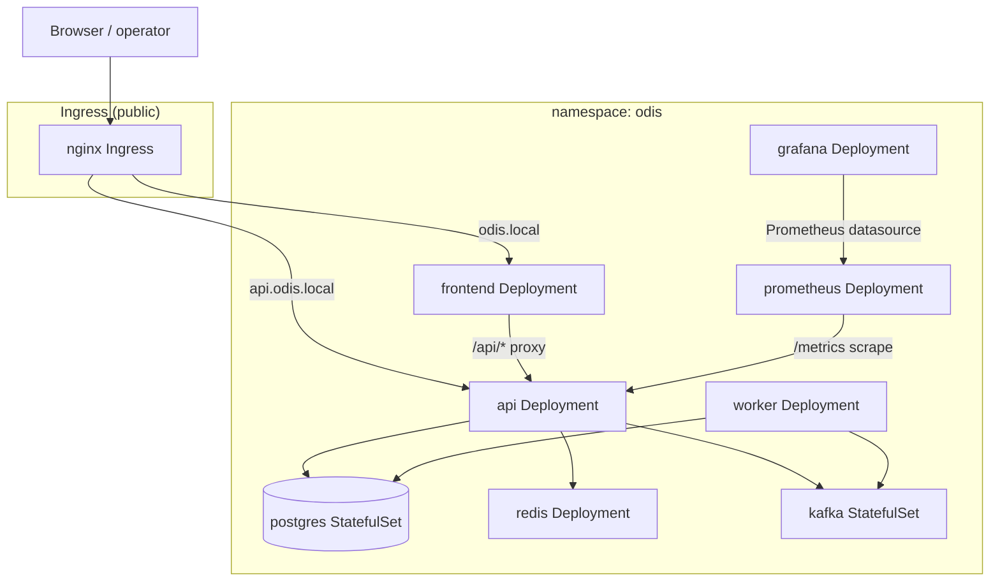

# Kubernetes Deployment

This document describes the production-oriented Kubernetes deployment for ODIS. The manifests translate most of the [Docker Runtime](docker-runtime.md) topology from PR131 without redesigning the architecture.

**Known gap:** `k8s/` has no manifests for `mosquitto` or `mqtt-bridge`, unlike the Docker Compose topology (both always-on there). A Kubernetes deployment today only supports direct HTTP ingestion (`POST /observations`); the MQTT production path (`PlantAlphaSimulator → MQTT → mqtt-bridge → API`) is Compose-only until those manifests are added.

For platform context, see [Platform Architecture](platform-architecture.md).

---

## Namespace

All resources run in the **`odis`** namespace (`k8s/namespace.yaml`).

```bash
kubectl apply -f k8s/namespace.yaml
```

---

## Manifest layout

```
k8s/
  namespace.yaml
  config/                 # Shared ConfigMaps and Secrets
  ingress/                # Public HTTP routing
  api/
  worker/
  frontend/
  postgres/
  redis/
  kafka/
  prometheus/
  grafana/
  hpa/                    # Reserved for Horizontal Pod Autoscaler (future)
  timescaledb/            # Reserved for TimescaleDB (future)
  onnx-runtime/           # Reserved for ONNX Runtime service (future)
```

| Directory | Resources | Notes |
|-----------|-----------|-------|
| `config/` | ConfigMaps, Secrets | Non-sensitive env in `odis-config`; credentials in Secrets |
| `api/` | Deployment, ClusterIP Service | FastAPI platform API |
| `worker/` | Deployment | Background job processor (no Service) |
| `frontend/` | Deployment, ClusterIP Service | nginx + React monitoring console |
| `postgres/` | StatefulSet, headless Service | Durable platform state |
| `redis/` | Deployment, ClusterIP Service | Digital twin cache |
| `kafka/` | StatefulSet, headless Service | KRaft event backbone |
| `prometheus/` | Deployment, Service, PVC | Metrics collection |
| `grafana/` | Deployment, Service, PVC, ConfigMap | Dashboards and visualization |
| `ingress/` | Ingress | Public frontend and API endpoints |

Each service owns its manifests. Future components (HPA, TimescaleDB, ONNX Runtime) add new directories under `k8s/` without restructuring existing paths.

---

## Deployment diagram



ASCII equivalent:

```
                         ┌──────────────────┐
  Browser ──────────────▶│  Ingress (nginx) │
                         └────────┬─────────┘
                    odis.local   │   api.odis.local
                         ┌───────┴────────┐
                         ▼                ▼
                  ┌─────────────┐  ┌─────────────┐
                  │  frontend   │  │     api     │
                  │   (nginx)   │  │  (FastAPI)  │
                  └──────┬──────┘  └──────┬──────┘
                         │ /api/*         │
                         └───────┬────────┘
                                 ▼
              ┌──────────────────┼──────────────────┐
              ▼                  ▼                  ▼
         ┌─────────┐       ┌─────────┐       ┌─────────┐
         │ postgres│       │  redis  │       │  kafka  │
         └─────────┘       └─────────┘       └─────────┘
                                 ▲
                                 │
                          ┌──────┴──────┐
                          │   worker    │
                          └─────────────┘

         prometheus ──scrape──▶ api /metrics
         grafana ──query──▶ prometheus
```

---

## Startup order

Apply manifests in dependency order:

1. **Namespace and configuration**
   ```bash
   kubectl apply -f k8s/namespace.yaml
   kubectl apply -f k8s/config/
   ```

   Replace `CHANGE_ME` values in `k8s/config/postgres-secret.yaml` and `k8s/config/grafana-secret.yaml` before production, or create Secrets with `kubectl create secret` (see [Updating configuration](#updating-configuration)).

2. **Stateful infrastructure** (postgres, kafka)
   ```bash
   kubectl apply -f k8s/postgres/
   kubectl apply -f k8s/kafka/
   kubectl apply -f k8s/redis/
   ```

3. **Application tier** (api, then dependents)
   ```bash
   kubectl apply -f k8s/api/
   kubectl apply -f k8s/worker/
   kubectl apply -f k8s/frontend/
   kubectl apply -f k8s/prometheus/
   kubectl apply -f k8s/grafana/
   ```

4. **Ingress**
   ```bash
   kubectl apply -f k8s/ingress/
   ```

Init containers enforce the same ordering as Docker Compose `depends_on`:

| Stage | Condition |
|-------|-----------|
| postgres, redis, kafka | Readiness probes pass |
| api | Init containers wait for postgres, redis, kafka; `/live` becomes healthy |
| worker, frontend, prometheus | Init containers wait for api `/live` |
| grafana | Init container waits for prometheus `/-/healthy` |
| api `/ready` | Returns 200 once worker heartbeats are recorded |

Apply everything at once after images and secrets are ready:

```bash
kubectl apply -R -f k8s/
```

---

## Building images

Build application images from the repository root (same Dockerfiles as Compose):

```bash
docker build -f infra/docker/api/Dockerfile -t odis-api:latest .
docker build -f infra/docker/worker/Dockerfile -t odis-worker:latest .
docker build -f frontend/Dockerfile -t odis-frontend:latest .
```

Load into a local cluster (kind/minikube) or push to your registry and update image references in the Deployment manifests.

---

## Networking

| Service | Type | Port | Exposure |
|---------|------|------|----------|
| frontend | ClusterIP | 80 | Ingress `odis.local` |
| api | ClusterIP | 8000 | Ingress `api.odis.local` |
| postgres | Headless ClusterIP | 5432 | Internal |
| redis | ClusterIP | 6379 | Internal |
| kafka | Headless ClusterIP | 9092, 9093 | Internal |
| worker | — | — | Internal (no Service) |
| prometheus | ClusterIP | 9090 | Internal |
| grafana | ClusterIP | 3000 | Internal |

The frontend nginx container proxies `/api/*` to the `api` Service (`infra/docker/nginx/default.conf`), matching Compose and Vite dev behavior.

Add hosts entries for local Ingress testing:

```
127.0.0.1 odis.local api.odis.local
```

---

## Persistent storage

| Component | Storage | Mount |
|-----------|---------|-------|
| postgres | StatefulSet volumeClaimTemplate (10Gi) | `/var/lib/postgresql/data` |
| kafka | StatefulSet volumeClaimTemplate (10Gi) | `/var/lib/kafka/data` |
| grafana | PVC `grafana-data` (5Gi) | `/var/lib/grafana` |
| prometheus | PVC `prometheus-data` (10Gi) | `/prometheus` |

Redis is ephemeral (Deployment, no PVC), matching Compose.

---

## Health probes

| Workload | Liveness | Readiness |
|----------|----------|-----------|
| api | `GET /live` | `GET /ready` |
| worker | `pgrep -f backend.app.worker_main` | same |
| frontend | `GET /` | `GET /` |
| postgres | `pg_isready` | `pg_isready` |
| redis | `redis-cli ping` | `redis-cli ping` |
| kafka | `kafka-topics.sh --list` | same |
| prometheus | `GET /-/healthy` | `GET /-/ready` |
| grafana | `GET /api/health` | `GET /api/health` |

---

## Scaling

### API

Increase API replicas for horizontal scale:

```bash
kubectl scale deployment/api -n odis --replicas=3
```

Requirements:

- All replicas share the same `DATABASE_URL`, `REDIS_URL`, and `KAFKA_BOOTSTRAP_SERVERS`.
- Migrations run on each pod startup via the API entrypoint; for large production rollouts, prefer a dedicated migration Job and disable per-pod migrations.
- Future HPA manifests belong in `k8s/hpa/` without changing existing Deployment paths.

### Worker

Scale workers independently of the API:

```bash
kubectl scale deployment/worker -n odis --replicas=2
```

Workers consume jobs from Kafka; ensure consumer group configuration supports multiple instances. The API `/ready` probe checks for at least one healthy worker heartbeat.

---

## Updating configuration

### Non-sensitive settings

Edit `k8s/config/odis-configmap.yaml` (maps to `.env.example` variables):

- `LOG_LEVEL`, `ENVIRONMENT`, `CACHE_TTL_SECONDS`
- `REDIS_URL`, `KAFKA_BOOTSTRAP_SERVERS`
- `WORKER_HEARTBEAT_*`, `HEALTH_CHECK_TIMEOUT_SECONDS`
- `OTEL_*`

Apply and roll out:

```bash
kubectl apply -f k8s/config/odis-configmap.yaml
kubectl rollout restart deployment/api deployment/worker -n odis
```

### Secrets

Do not commit production credentials. Create or update Secrets out of band:

```bash
kubectl create secret generic odis-postgres -n odis \
  --from-literal=POSTGRES_DB=odis \
  --from-literal=POSTGRES_USER=odis \
  --from-literal=POSTGRES_PASSWORD='<password>' \
  --from-literal=DATABASE_URL='postgresql+psycopg://odis:<password>@postgres:5432/odis' \
  --dry-run=client -o yaml | kubectl apply -f -

kubectl create secret generic odis-grafana -n odis \
  --from-literal=GF_SECURITY_ADMIN_USER='<user>' \
  --from-literal=GF_SECURITY_ADMIN_PASSWORD='<password>' \
  --dry-run=client -o yaml | kubectl apply -f -
```

Restart affected workloads after secret rotation.

### Prometheus and Grafana provisioning

- Scrape config: `k8s/config/prometheus-configmap.yaml`
- Grafana datasources/dashboards: `k8s/config/grafana-provisioning-configmap.yaml`, `k8s/grafana/configmap-dashboard.yaml`

---

## Future extensions

| Addition | Location | Impact |
|----------|----------|--------|
| Horizontal Pod Autoscaler | `k8s/hpa/` | Reference existing `api` and `worker` Deployments |
| TimescaleDB | `k8s/postgres/` (TimescaleDB image) | PostgreSQL extension for telemetry hypertables; see [TimescaleDB Foundation](timescaledb-foundation.md) |
| ONNX Runtime | `k8s/onnx-runtime/` | New Deployment + ClusterIP Service; API env extension |

No changes to the per-service directory layout are required.

---

## Verification

```bash
kubectl get pods -n odis
kubectl get ingress -n odis
curl -fsS http://api.odis.local/health
curl -fsS http://odis.local/
```

---

## File cross-reference

| Docker Compose | Kubernetes |
|----------------|------------|
| `docker-compose.yml` | `k8s/**` |
| `.env.example` | `k8s/config/odis-configmap.yaml` + Secrets |
| `infra/docker/prometheus/prometheus.yml` | `k8s/config/prometheus-configmap.yaml` |
| `infra/docker/grafana/` | `k8s/config/grafana-provisioning-configmap.yaml`, `k8s/grafana/configmap-dashboard.yaml` |
| `infra/docker/api/Dockerfile` | `k8s/api/deployment.yaml` (`odis-api:latest`) |
| `infra/docker/worker/Dockerfile` | `k8s/worker/deployment.yaml` |
| `frontend/Dockerfile` | `k8s/frontend/deployment.yaml` |
