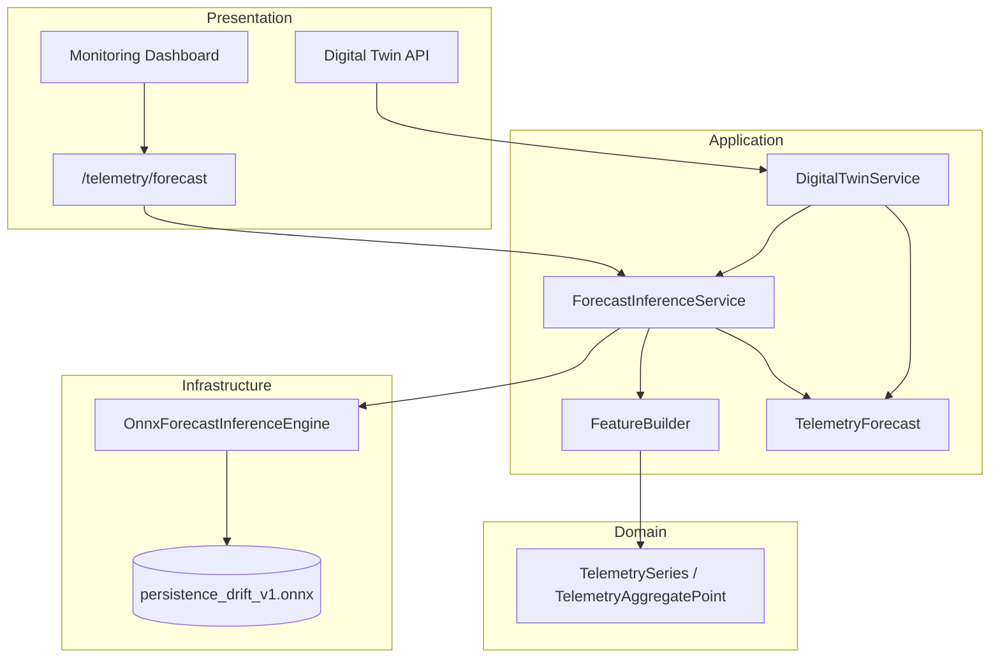

# Telemetry Forecasting

This document describes the ONNX-backed telemetry forecasting path in ODIS. Forecasts are **operator-facing analytics** — they do not replace deterministic reasoning, operational state, or recommendations.

For historical telemetry APIs, see [Historical Telemetry APIs](telemetry-history.md). For aggregate feature windows, see [Continuous Aggregates](continuous-aggregates.md).

---

## Design Goals

| Goal | Approach |
|------|----------|
| Keep reasoning deterministic | Forecasts are a parallel read path; `ReasoningSession` never calls ONNX |
| Swap models without app changes | Application depends on `ForecastInferenceEngine` protocol only |
| Hide ONNX Runtime | `OnnxForecastInferenceEngine` is the sole ONNX import site |
| Reuse telemetry rollups | `FeatureBuilder` consumes `TelemetrySeries` / continuous aggregates |
| Fast inference | ONNX session loaded once per process at startup |

---

## Architecture



---

## Domain Model

```python
@dataclass(frozen=True)
class ForecastSample:
    timestamp: datetime
    value: float

@dataclass(frozen=True)
class TelemetryForecast:
    asset_id: str
    measurement_type: str
    unit: str
    model_id: str
    horizon_start: datetime      # last observed aggregate bucket
    generated_at: datetime
    samples: tuple[ForecastSample, ...]  # oldest → newest
```

`TelemetryForecast` mirrors `TelemetrySeries` conventions: immutable, validated ordering, no ORM or ONNX types.

---

## Application Components

### `ForecastInferenceService`

The **only** application component responsible for forecasting:

1. Load aggregate telemetry via `TelemetryAggregateRepository`
2. Build normalized features with `FeatureBuilder`
3. Call `ForecastInferenceEngine.predict()`
4. Denormalize outputs and map future bucket timestamps
5. Return `TelemetryForecast`

### `FeatureBuilder`

Converts telemetry read models into fixed-length normalized tensors:

- Default context window: 24 buckets (configurable via `FORECAST_CONTEXT_LENGTH`)
- Pads short histories with the earliest available value
- Z-score normalizes the context window
- Stores `mean` / `std` for denormalizing model outputs

### `ForecastInferenceEngine` (protocol)

```python
class ForecastInferenceEngine(Protocol):
    @property
    def model_spec(self) -> ForecastModelSpec: ...

    def predict(self, features: tuple[float, ...]) -> tuple[float, ...]: ...
```

Application code never imports `onnxruntime`. Tests inject fakes implementing this protocol.

---

## Infrastructure Adapter

`OnnxForecastInferenceEngine` (`backend/app/infrastructure/inference/onnx_forecast_engine.py`):

- Loads `InferenceSession` once via `from_model_path()`
- Enables extended graph optimizations
- Uses CPU execution provider (edge-friendly default)
- Maps ONNX inputs/outputs using `ForecastModelSpec`

Factory: `create_forecast_inference_engine(settings)` in `bootstrap_application_runtime()`.

---

## Model Lifecycle

### 1. Training (offline)

Train or fine-tune a model outside the ODIS runtime. Industrial options for lightweight deployment:

| Approach | When to use |
|----------|-------------|
| **Simple statistical / drift baselines** | Architecture validation, smoke tests |
| **TCN / MLP-Mixer (<1M params)** | CPU edge deployment with ONNX export |
| **NanoForecast-style tiny transformers** | Zero-shot or few-shot with small ONNX artifacts (~1–2 MB) |
| **Foundation models (Chronos, TimesFM)** | Higher accuracy when GPU or remote inference is available |

ODIS does not embed a training pipeline in v1. Training artifacts are produced offline.

### 2. Export

Export to ONNX with a documented tensor contract:

| Tensor | Shape | Dtype |
|--------|-------|-------|
| `context` | `[batch, context_length]` | `float32` |
| `forecast` | `[batch, horizon_steps]` | `float32` |

Bundled validation model: `persistence_drift_v1.onnx` — linear drift extrapolation:

```text
slope = context[-1] - context[-2]
forecast[i] = context[-1] + slope * (i + 1)
```

Regenerate with:

```bash
pip install -e ".[forecast]"
python scripts/export_persistence_forecast_onnx.py
```

### 3. Inference (runtime)

At **API and worker startup**, `bootstrap_application_runtime()` calls `create_forecast_inference_engine()`:

- Reads `ONNX_MODEL_PATH` (defaults to bundled model)
- Creates one `InferenceSession` per process
- Reuses the session for all requests

Disable forecasting with `FORECAST_ENABLED=false`.

### 4. Prediction (request time)

```
GET /monitoring/assets/{asset_id}/telemetry/forecast?bucket=1h
```

or via digital twin assembly (`telemetry_forecasts` field).

Pipeline:

1. Query hourly/daily continuous aggregates for context
2. `FeatureBuilder` → normalized `context` tensor
3. ONNX `session.run()` → normalized horizon
4. Denormalize → `TelemetryForecast`

---

## Swapping Models

Change application behavior **without code changes** by updating environment configuration:

| Variable | Purpose |
|----------|---------|
| `FORECAST_ENABLED` | Toggle forecasting (`true` / `false`) |
| `ONNX_MODEL_PATH` | Path to replacement `.onnx` file |
| `ONNX_MODEL_ID` | Operator-facing model identifier in API responses |
| `FORECAST_CONTEXT_LENGTH` | Must match model input width |
| `FORECAST_HORIZON_STEPS` | Expected output width (truncates longer outputs) |

Requirements for drop-in replacement:

1. Same input/output names (`context`, `forecast`) or update `ForecastModelSpec`
2. Same tensor ranks and compatible shapes
3. Model expects **normalized** features (z-score); outputs are denormalized by `ForecastInferenceService`

For different tensor contracts, add a new infrastructure adapter or extend `ForecastModelSpec` — application services remain unchanged.

---

## Digital Twin Integration

`DigitalTwin` includes an optional `telemetry_forecasts` tuple. `DigitalTwinService`:

- Still composes operational state and recommendations from `MonitoringService` only
- Optionally calls `ForecastInferenceService.get_forecasts_for_asset()` when an engine is configured
- Swallows missing-telemetry errors (returns empty forecasts)

Forecasts are **additive** — they do not invalidate twin cache on reasoning events.

---

## API Endpoints

| Endpoint | Response |
|----------|----------|
| `GET /monitoring/assets/{asset_id}/telemetry/forecast` | `list[TelemetryForecastResponse]` |
| `GET /monitoring/assets/{asset_id}/digital-twin` | includes `telemetry_forecasts` |

Returns `503` when `FORECAST_ENABLED=false`.

---

## Metrics

| Metric | Description |
|--------|-------------|
| `forecast_inference_total` | Successful inference count |
| `forecast_inference_failures_total` | Failed inference count |
| `forecast_inference_duration_seconds` | Inference latency histogram |

---

## Related Documentation

| Document | Topic |
|----------|-------|
| [Historical Telemetry APIs](telemetry-history.md) | Raw telemetry read path |
| [Continuous Aggregates](continuous-aggregates.md) | Feature windows for ONNX |
| [Platform Architecture](platform-architecture.md) | Layer boundaries |
