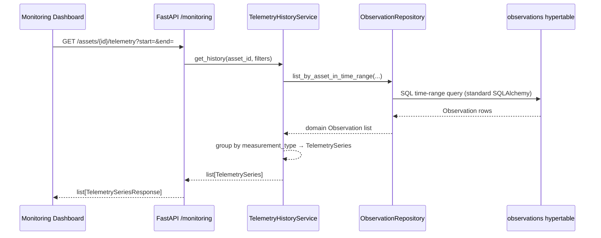
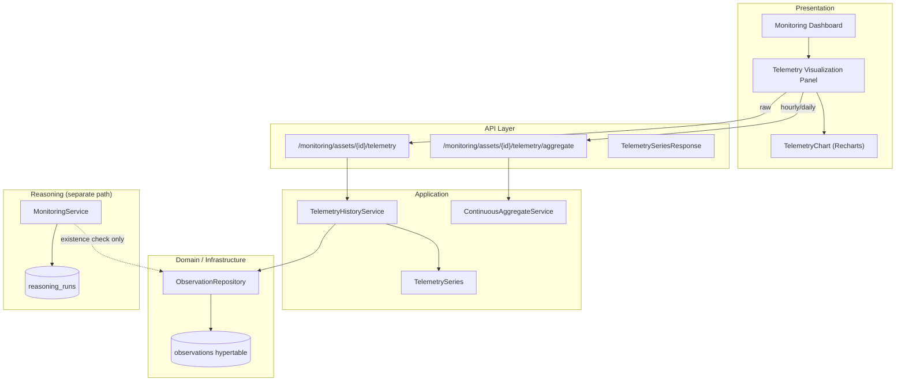

# Historical Telemetry APIs

This document describes how ODIS retrieves raw sensor telemetry for operator-facing history views. It builds on the [TimescaleDB Foundation](timescaledb-foundation.md) and complements monitoring endpoints that expose **reasoning history**, not time-series measurements.

For platform context, see [Platform Architecture](platform-architecture.md).

---

## Why Historical Telemetry Is Separate from Reasoning

ODIS has two distinct monitoring concerns:

| Concern | Source | Example endpoints |
|---------|--------|-------------------|
| **Reasoning history** | `reasoning_runs`, `decision_plans`, traces | `/monitoring/assets/{id}/history`, `/monitoring/runs/{id}` |
| **Telemetry history** | `observations` hypertable | `/monitoring/assets/{id}/telemetry` |

Reasoning endpoints answer *what the platform concluded* at a point in time. Telemetry endpoints answer *what was measured* over time. Keeping them separate:

- Preserves stable reasoning APIs as telemetry volume grows
- Allows time-range queries without loading full reasoning artifacts
- Prepares dashboards to consume continuous aggregates later without coupling to reasoning runs

The reasoning worker still loads observations for assessment; telemetry APIs are read-only projections for operators and future charting.

---

## TelemetrySeries Domain Model

Historical telemetry is exposed through an immutable domain projection — not ORM models or raw `Observation` entities.

```python
@dataclass(frozen=True)
class TelemetrySample:
    timestamp: datetime
    value: float

@dataclass(frozen=True)
class TelemetrySeries:
    asset_id: str
    measurement_type: str
    unit: str
    samples: tuple[TelemetrySample, ...]  # oldest → newest
```

| Field | Role |
|-------|------|
| `asset_id` | Asset scope for the series |
| `measurement_type` | Metric label (for example `stack_temperature`) |
| `unit` | Display unit for all samples in the series |
| `samples` | Ordered timestamp/value pairs |

`TelemetryHistoryService` is the **single place** historical telemetry is assembled. API handlers map `TelemetrySeries` to stable JSON via `TelemetrySeriesResponse`; they never return SQLAlchemy models.

---

## Query Flow



Pipeline summary:

1. **API** validates asset existence, time window, and `limit` (1–10,000).
2. **TelemetryHistoryService** queries observations and groups them into `TelemetrySeries`.
3. **ObservationRepository** issues efficient time-range filters using existing hypertable indexes — no Timescale-specific SQL in the application layer.
4. **Response** returns chronologically ordered samples per measurement type.

---

## API Endpoints

| Method | Path | Purpose |
|--------|------|---------|
| `GET` | `/monitoring/assets/{asset_id}/telemetry` | Historical samples in an optional time window |
| `GET` | `/monitoring/assets/{asset_id}/telemetry/latest` | Newest samples per measurement type |

### Query parameters

| Parameter | Endpoints | Description |
|-----------|-----------|-------------|
| `start` | history | Inclusive window start (ISO 8601) |
| `end` | history | Inclusive window end (ISO 8601) |
| `measurement_type` | both | Optional metric filter |
| `limit` | both | Max raw observations (default 1000 history / 1 latest) |

Responses return `list[TelemetrySeriesResponse]` — stable, operator-friendly JSON grouped by measurement type.

---

## Industrial API Patterns Adopted

Research across TimescaleDB, Grafana, Azure IoT Hub, and AWS IoT SiteWise informed the design. ODIS adopted only patterns that fit a reasoning-centric platform:

| Pattern | Source inspiration | ODIS adoption |
|---------|-------------------|---------------|
| Asset-scoped history | SiteWise `GetAssetPropertyValueHistory` | `/monitoring/assets/{id}/telemetry` |
| Time-range filters | Grafana / Timescale `time_bucket` queries | `start` / `end` query params |
| Metric filtering | Azure IoT message queries | `measurement_type` param |
| Latest value reads | Grafana instant queries | `/telemetry/latest` |
| Series grouping | Grafana time-series panels | `TelemetrySeries` per metric |

Not adopted: Flux/InfluxQL, SiteWise asset model imports, Grafana dashboard query DSL, or forecasting endpoints.

---

## Repository Extension

`ObservationRepository` gained one method:

```python
def list_by_asset_in_time_range(
    self,
    asset_id: str,
    *,
    start: datetime | None = None,
    end: datetime | None = None,
    measurement_type: str | None = None,
    limit: int | None = None,
    newest_first: bool = False,
) -> list[Observation]:
```

SQLAlchemy uses standard `WHERE` + `ORDER BY` + `LIMIT` against indexes defined in the TimescaleDB foundation migration. The in-memory implementation mirrors the contract for tests.

---

## Frontend Integration

The monitoring dashboard includes a **Telemetry** panel with operator-friendly time-series charts. Operators choose:

| Control | Options | Default behavior |
|---------|---------|------------------|
| **Time range** | Last hour, 24 hours, 7 days, 30 days | Last 24 hours |
| **Resolution** | Raw, hourly, daily | Raw for 1 hour; hourly for 24 hours and 7 days; daily for 30 days |
| **Measurement** | One metric at a time | First available metric for the asset |

### Raw versus aggregate visualization

| Resolution | API | Chart behavior |
|------------|-----|----------------|
| **Raw** | `GET /monitoring/assets/{id}/telemetry` | Line chart of timestamp/value samples in the selected time window |
| **Hourly** | `GET /monitoring/assets/{id}/telemetry/aggregate?bucket=1h` | Line chart of `avg_value` per hour; tooltip shows avg, min, max, and `sample_count` |
| **Daily** | `GET /monitoring/assets/{id}/telemetry/aggregate?bucket=1d` | Line chart of `avg_value` per day; tooltip shows avg, min, max, and `sample_count` |

The UI fetches **only the selected resolution** for the active time window. It does not load raw, hourly, and daily datasets on every selection change.

Samples are rendered in chronological order (oldest → newest).

### Why metrics are not combined

Each `TelemetrySeries` carries its own `unit` (for example `C` versus `%`). The dashboard charts **one measurement type at a time** so the y-axis always represents a single unit. Mixing unlike units on one axis would be misleading for operators.

### Forecast overlay preparation (PR138)

The chart component is intentionally measurement-scoped and time-range aware. PR138 can overlay forecast lines on the same axis without changing historical retrieval APIs: forecasts will attach to the selected measurement and resolution, reusing the existing x/y layout and tooltip patterns.

---

## Continuous Aggregates

Downsampled telemetry is available via `ContinuousAggregateService` and `GET /monitoring/assets/{id}/telemetry/aggregate`. See [Continuous Aggregates](continuous-aggregates.md) for view definitions, refresh policies, and the relationship to raw history.

---

## Future: ONNX

Forecasting is documented in [Telemetry Forecasting](telemetry-forecasting.md).

| Capability | Relationship to telemetry APIs |
|------------|-------------------------------|
| **ONNX inference** | Parallel read path via `/telemetry/forecast`; overlays on charts |

Raw `TelemetrySeries` responses stay stable. ONNX adds forecasts without changing the historical domain contract.

---

## Architecture



---

## Related Documentation

| Document | Topic |
|----------|-------|
| [TimescaleDB Foundation](timescaledb-foundation.md) | Hypertable schema, indexes, analytics roadmap |
| [Platform Architecture](platform-architecture.md) | Overall platform design |
