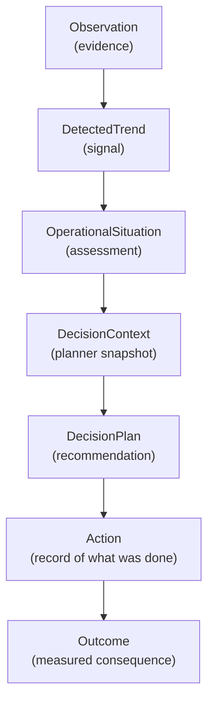
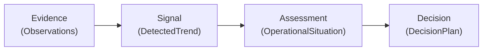
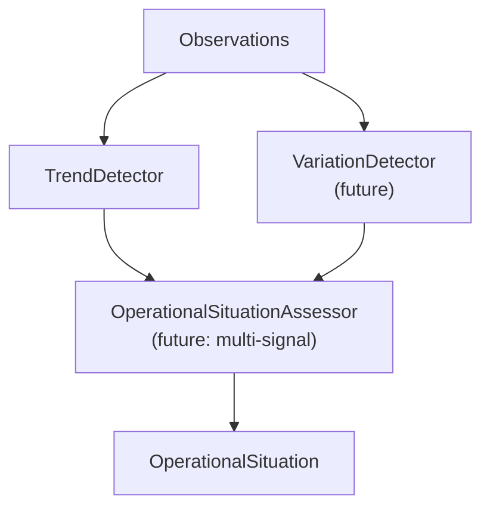

# ODIS Reasoning Pipeline

This document describes the operational reasoning flow modeled by ODIS — what each stage represents, why it exists, and what it deliberately does not do.

For repository layout and layer responsibilities, see [Architecture](architecture.md).

## Pipeline overview



The executable pipeline today runs from **Observation** through **DecisionPlan**. `Action` and `Outcome` exist as domain entities and complete the conceptual lifecycle, but no application component creates them yet.

Each `ReasoningSession.run()` also creates a `ReasoningRun` — application metadata with a unique id and start timestamp. When a `ReasoningRunRepository` is configured, the run is saved immediately (before detectors execute) so the execution has a durable identity. Runs are not domain events; they are bookkeeping for traceability and future replay.

At the end of a successful run, the session can persist a `ReasoningRunIndex` — an immutable snapshot that correlates the run id with every artifact id produced during that execution (observations, situation, context, plan, action, and outcome). This index is application metadata stored separately from domain entities, so a replay component can resolve which artifacts belong to a run without recomputing the pipeline or adding run ids to domain records.

## Reasoning vs. replay

**Reasoning** (`ReasoningSession.run`) executes the pipeline: detectors derive signals, the assessor forms a situation, the planner produces a recommendation, and configured repositories persist each artifact as it is created. Events may be published along the way. This path creates new records.

**Replay** (`ReasoningReplayer.replay`) reconstructs a completed run from persisted records only. It loads the `ReasoningRun`, resolves artifact ids through `ReasoningRunIndex`, and fetches observations, situation, context, and plan from their repositories. It does not invoke detectors, assessors, or planners; it does not publish events or write to storage. Signals (`DetectedTrend`, `DetectedVariation`) are not persisted today, so replay omits them rather than recomputing.

Use `ReplayResult.from_execution` to bundle in-memory session output immediately after a run. Use `ReasoningReplayer` when the artifacts already exist in storage and you need a read-only view of what happened.

**Comparison** (`ReasoningComparator.compare`) analyzes differences between two reconstructed executions. Replay reconstructs a single execution; comparison replays both runs and reports whether observation count, assessment, plan priority, or recommendation changed. It does not score, rank, or explain differences.

## Stage reference

### Observation

**Represents:** An immutable measurement recorded from the environment — a fact at a point in time.

**Why it exists:** Operational reasoning must begin with evidence, not interpretation. Observations are external facts: a temperature reading, a pressure value, a flow rate. They exist independently of any assessment or decision.

**What it does not do:**

- Interpret whether the value is good or bad
- Detect patterns across multiple readings
- Trigger actions or recommendations

Observations reference an asset and measurement type but do not own them.

---

### DetectedTrend

**Represents:** A deterministic signal derived from a sequence of observations on a single asset and measurement type.

**Why it exists:** Raw measurements must be distilled into a pattern before operational meaning can be assigned. The trend answers a narrow question: is the overall direction increasing, decreasing, or stable?

**What it does not do:**

- Assess operational significance (that is the assessor's role)
- Produce recommendations
- Account for variability within the sequence (see [Extending ODIS](#extending-odis))

The current `TrendDetector` compares the first and last values after timestamp ordering. It is intentionally simple.

---

### OperationalSituation

**Represents:** The system's assessment of operational conditions at a point in time — an interpretation derived from evidence and signal.

**Why it exists:** A trend alone is not an operational situation. "Increasing" is a mathematical classification; "Increasing operational stress detected" is an operational assessment. The situation records both the assessment text and the observation references that supported it.

**What it does not do:**

- Plan or recommend actions
- Mutate when new observations arrive (a revised interpretation is a new situation)
- Store the raw trend object (the signal informs assessment; only the assessment text is retained on the situation)

---

### DecisionContext

**Represents:** A frozen snapshot of everything the planner knew when reasoning began.

**Why it exists:** Recommendations must be explainable in terms of what was known at decision time. The context captures goal reference, situation reference, and a copy of the assessment — so the planner can operate on a self-contained input without resolving external records.

**What it does not do:**

- Perform planning (it is input to the planner, not output)
- Update after creation
- Embed the full observation history (that remains on the situation via observation references)

---

### DecisionPlan

**Represents:** A generated recommendation — priority, recommended action, and justification.

**Why it exists:** Operational systems must produce actionable output with explicit rationale. The plan is the first decision artifact: what to prioritize, what to do, and why.

**What it does not do:**

- Execute the recommended action
- Guarantee correctness (current rules are placeholder logic)
- Revise itself (a changed recommendation is a new plan)

---

### Action

**Represents:** A human or system action taken in response to a plan.

**Why it exists:** Decisions only matter if something happens afterward. Recording actions closes the loop between recommendation and execution, enabling accountability and later outcome measurement.

**What it does not do:**

- Exist in the executable pipeline yet (domain entity only)
- Automatically follow from a plan (execution is external to ODIS today)

---

### Outcome

**Represents:** The measured consequence of an action.

**Why it exists:** Operational reasoning improves when consequences are recorded. Outcomes allow future reasoning cycles to learn whether a prior decision had the intended effect — without rewriting the original plan or action.

**What it does not do:**

- Exist in the executable pipeline yet (domain entity only)
- Feed back into planning automatically (closed-loop reasoning is future work)

## Executable vs. conceptual stages

| Stage | Domain entity | Application component | In demos/tests today |
|-------|---------------|----------------------|----------------------|
| Observation | Yes | — (constructed directly) | Yes |
| DetectedTrend | Yes (`DetectedTrend`) | `TrendDetector` | Yes |
| OperationalSituation | Yes | `OperationalSituationAssessor` | Yes |
| DecisionContext | Yes | `create_decision_context` | Yes |
| DecisionPlan | Yes | `DecisionPlanner` | Yes |
| Action | Yes | Not implemented | No |
| Outcome | Yes | Not implemented | No |

## Evidence, signal, assessment, decision

The pipeline deliberately separates four kinds of knowledge:



Mixing these concerns — for example, storing trend direction directly on a plan — would make it impossible to swap signal detectors or planning strategies without rewriting downstream records.

## Extending ODIS

### Motivation: the oscillating scenario

The `examples/oscillating_operations_demo.py` walkthrough exposes a limitation in single-signal reasoning. Consider a flow rate sequence:

```
100 → 150 → 80 → 160 → 70 → 100
```

First and last values are equal. `TrendDetector` classifies this as **stable**. The pipeline then assesses "Operational conditions stable" and recommends "Continue monitoring" — a misleading conclusion for visibly unstable operations.

This is not a bug in the architecture. It is a boundary of the current signal detector. The pipeline correctly propagates a stable trend into a stable assessment and a low-priority plan. The weakness is that **one signal type is insufficient** for operational truth.

### Adding new signal detectors

Future detectors should follow the same pattern as `TrendDetector`:

1. Accept a sequence of observations (with appropriate homogeneity constraints)
2. Return a dedicated result type (e.g., `DetectedVariation`)
3. Remain in the application layer as replaceable components

A hypothetical `VariationDetector` might classify sequences by spread or oscillation amplitude without modifying `TrendDetector` or domain entities. An assessor could then consume **multiple signals** when forming an operational situation:



This extension requires no new entities — only new application components and assessor logic that combines multiple signal inputs. The append-only, immutable model remains intact.

### Other extension points

| Extension | Natural location | Impact on domain |
|-----------|-----------------|------------------|
| New signal detector | `src/application/` | New value object for result type |
| New planning strategy | `src/application/` | None (consumes existing `DecisionContext`) |
| Persistence | `src/infrastructure/` | Implements existing repository interfaces (domain entities and reasoning runs) |
| Telemetry ingestion | `src/infrastructure/` | Produces domain `Observation` records |
| Event dispatch | `src/infrastructure/` | Publishes existing domain event contracts |

## Related documentation

- [Architecture](architecture.md) — layer structure and design principles
- [README](../README.md) — capabilities, limitations, and roadmap
