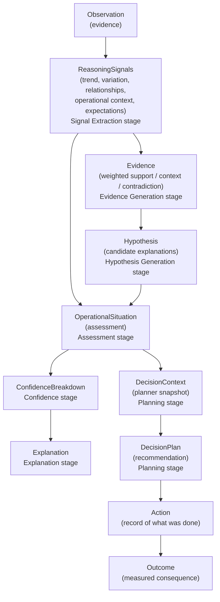
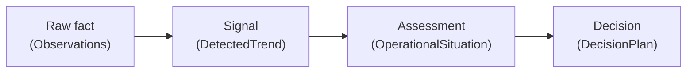
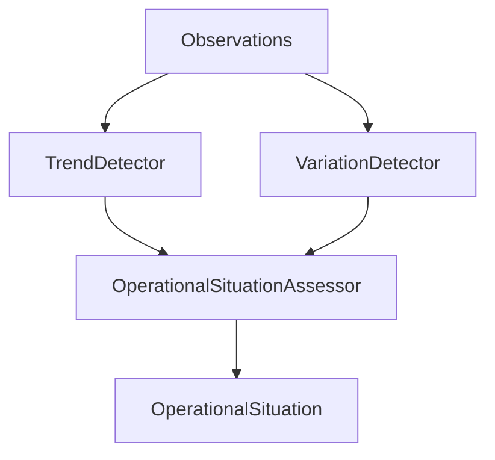

# ODIS Reasoning Pipeline

This document describes the operational reasoning flow modeled by ODIS — what each stage represents, why it exists, and what it deliberately does not do.

For repository layout and layer responsibilities, see [Architecture](architecture.md).

## Pipeline overview

`ReasoningSession.run()` executes seven `ReasoningStage` objects in a fixed order — Signal Extraction, Evidence Generation, Hypothesis Generation, Assessment, Confidence, Explanation, Planning (`src/application/reasoning/`) — each reading and extending a shared, immutable `ReasoningContext`. `Action` and `Outcome` are recorded immediately afterward, outside the stage loop.



The executable pipeline today runs from **Observation** through **Outcome**. `Action` and `Outcome` records are created by `record_action` and `record_outcome` during each `ReasoningSession.run()`, completing the conceptual lifecycle. They are not yet wired to external execution systems or closed-loop learning.

Each `ReasoningSession.run()` also creates a `ReasoningRun` — application metadata with a unique id and start timestamp. When a `ReasoningRunRepository` is configured, the run is saved immediately (before detectors execute) so the execution has a durable identity. Runs are not domain events; they are bookkeeping for traceability and future replay.

At the end of a successful run, the session can persist a `ReasoningRunIndex` — an immutable snapshot that correlates the run id with every artifact id produced during that execution (observations, situation, context, plan, action, and outcome). This index is application metadata stored separately from domain entities, so a replay component can resolve which artifacts belong to a run without recomputing the pipeline or adding run ids to domain records.

## Reasoning vs. replay

**Reasoning** (`ReasoningSession.run`) executes the pipeline: detectors derive signals, the assessor forms a situation, the planner produces a recommendation, and configured repositories persist each artifact as it is created. Events may be published along the way. This path creates new records.

**Replay** (`ReasoningReplayer.replay`) reconstructs a completed run from persisted records only. It loads the `ReasoningRun`, resolves artifact ids through `ReasoningRunIndex`, and fetches observations, situation, context, and plan from their repositories. It does not invoke detectors, assessors, or planners; it does not publish events or write to storage. Signals (`DetectedTrend`, `DetectedVariation`) are not persisted today, so replay omits them rather than recomputing.

Use `ReplayResult.from_execution` to bundle in-memory session output immediately after a run. Use `ReasoningReplayer` when the artifacts already exist in storage and you need a read-only view of what happened.

**Comparison** (`ReasoningComparator.compare`) analyzes differences between two reconstructed executions. Replay reconstructs a single execution; comparison replays both runs and reports whether observation count, assessment, plan priority, or recommendation changed. It does not score, rank, or explain differences.

Escalation analysis is a read-side capability built on replay and comparison. It does not perform operational reasoning or alter historical records.

Stability analysis examines how operational assessment evolves between consecutive reasoning runs. It replays both runs and checks whether assessment text indicates conditions became more stable, less stable, or unchanged — using a simple substring rule on *"unstable"*. This is separate from escalation analysis, which tracks plan priority changes only.

Recurrence analysis identifies whether operational situations have appeared previously using deterministic matching over reconstructed executions.

## Stage reference

### Observation

**Represents:** An immutable measurement recorded from the environment — a fact at a point in time.

**Why it exists:** Operational reasoning must begin with evidence, not interpretation. Observations are external facts: a temperature reading, a pressure value, a flow rate. They exist independently of any assessment or decision.

**What it does not do:**

- Interpret whether the value is good or bad
- Detect patterns across multiple readings
- Trigger actions or recommendations

Observations reference an asset and measurement type but do not own them.

---

### DetectedTrend

**Represents:** A deterministic signal derived from a sequence of observations on a single asset and measurement type.

**Why it exists:** Raw measurements must be distilled into a pattern before operational meaning can be assigned. The trend answers a narrow question: is the overall direction increasing, decreasing, or stable?

**What it does not do:**

- Assess operational significance (that is the assessor's role)
- Produce recommendations
- Account for variability within the sequence (see [Extending ODIS](#extending-odis))

`TrendDetector` compares the mean of the first half of the sequence against the mean of the second half, normalized by the sequence's own spread — not a first-vs-last comparison. Endpoint comparison misreads any cyclical signal as "trending" whenever the window happens to start and end at different points in the oscillation; per-step delta-sign majority voting is also too weak in practice, since a slow real drift superimposed on larger-amplitude oscillation produces a near-50/50 split of up/down steps (verified against real Plant Alpha telemetry, not just synthetic sequences). Split-half comparison cancels oscillation far more effectively while staying scale-independent across measurement types.

---

### DetectedVariation

**Represents:** A deterministic signal describing how much individual readings spread within a homogeneous observation sequence.

**Why it exists:** Trend direction alone cannot distinguish steady drift from oscillation. Variation complements trend by classifying spread as low or high against a generic threshold.

**What it does not do:**

- Assess operational significance (that is the assessor's role)
- Replace trend detection

`VariationDetector` uses a simple max-min spread threshold. It runs alongside `TrendDetector` on every `ReasoningSession.run()`.

Trend and variation are two of five outputs the **Signal Extraction** stage (`SignalExtractionStage`) produces together as `ReasoningSignals`, in a single pass, on every run — the other three are relationship analysis (correlation/contradiction), the `OperationalContext`, and `ExpectationAnalysis` from the configured profile. See [Cross-measurement and expectation stages](#cross-measurement-and-expectation-stages) below.

---

### Evidence

**Represents:** A single weighted, typed observation about what the signals showed — a latest reading, a trend direction, a recent delta, sample support, or a cross-measurement correlation or contradiction — tagged with a role (`PRIMARY_SUPPORT`, `CONTEXT`, `CORROBORATING`, or `CONTRADICTING`).

**Why it exists:** An assessment needs to point at *specific, itemized reasons*, not just a signal bundle. `Evidence` gives the assessment (and downstream explanation) a concrete, weighted list to cite instead of re-deriving justification from raw signals after the fact.

**What it does not do:**

- Decide the assessment (evidence informs assessment; it does not compute one)
- Carry hypothesis or confidence information (those are later stages)

**Stage:** Evidence Generation (`EvidenceGenerationStage`, `generate_evidence_from_signals`). Runs immediately after Signal Extraction, deriving each `Evidence` item deterministically from `ReasoningSignals`.

---

### Hypothesis

**Represents:** A small (1–2), deterministic set of candidate explanations for what the signals and evidence show — e.g. cooling degradation, hydrogen supply issue, sensor drift, load change, or unknown — each with a rationale and the specific evidence ids that support it.

**Why it exists:** Distinguishing "the reading changed" from "here is the most likely reason it changed, and here is what would have to be true for a competing explanation instead" is what makes an assessment an *investigation* rather than a threshold alert. Hypotheses are the mechanism for stating and ranking those competing explanations.

**What it does not do:**

- Choose the final assessment text (the assessor still owns that)
- Score its own likelihood (see Confidence, below)

**Stage:** Hypothesis Generation (`HypothesisStage`, `generate_hypotheses_from_signals`). Runs after Evidence Generation; the primary hypothesis is attached to the assessment summary produced by the next stage.

---

### OperationalSituation

**Represents:** The system's assessment of operational conditions at a point in time — an interpretation derived from evidence and signal.

**Why it exists:** A trend alone is not an operational situation. "Increasing" is a mathematical classification; "Increasing operational stress detected" is an operational assessment. The situation records both the assessment text and the observation references that supported it.

**What it does not do:**

- Plan or recommend actions
- Mutate when new observations arrive (a revised interpretation is a new situation)
- Store the raw trend object (the signal informs assessment; only the assessment text is retained on the situation)

**Stage:** Assessment (`AssessmentStage`), which wraps the existing `OperationalSituationAssessor` unchanged and bundles its output — `OperationalSituation`, `StructuredAssessment`, the primary hypothesis, and supporting evidence — into an `AssessmentSummary`.

---

### ConfidenceBreakdown

**Represents:** A deterministic confidence score for the produced assessment, derived from the assessment summary, evidence, hypotheses, structured assessment, and primary observations.

**Why it exists:** Not every assessment deserves equal trust — a situation backed by strong correlated evidence and a clear hypothesis should read differently from one backed by a single reading. `ConfidenceBreakdown` makes that distinction explicit and auditable instead of implicit in prose.

**What it does not do:**

- Change the assessment or plan (confidence is scored *about* the assessment, not folded back into changing it)
- Use ML or probabilistic inference — scoring is deterministic, the same rule for the same inputs every time

**Stage:** Confidence (`ConfidenceStage`, `score_assessment_confidence`). Runs after Assessment; its output is also written back onto the `AssessmentSummary`.

---

### Explanation

**Represents:** A structured, deterministic explanation assembled from the assessment summary, evidence, hypotheses, and confidence — the human-readable "why" behind the recommendation that follows.

**Why it exists:** Explainability is a stated non-negotiable for ODIS (see [Architecture](architecture.md)). `Explanation` is the artifact that makes the reasoning chain inspectable *before* planning happens, rather than reconstructed after the fact from the plan alone.

**What it does not do:**

- Produce or alter the recommendation (that remains the Planning stage's responsibility)

**Stage:** Explanation (`ExplanationStage`, `build_explanation`). Runs after Confidence and before Planning.

---

### DecisionContext

**Represents:** A frozen snapshot of everything the planner knew when reasoning began.

**Why it exists:** Recommendations must be explainable in terms of what was known at decision time. The context captures goal reference, situation reference, and a copy of the assessment — so the planner can operate on a self-contained input without resolving external records.

**What it does not do:**

- Perform planning (it is input to the planner, not output)
- Update after creation
- Embed the full observation history (that remains on the situation via observation references)

---

### DecisionPlan

**Represents:** A generated recommendation — priority, recommended action, and justification.

**Why it exists:** Operational systems must produce actionable output with explicit rationale. The plan is the first decision artifact: what to prioritize, what to do, and why.

**What it does not do:**

- Execute the recommended action
- Guarantee correctness (current rules are placeholder logic)
- Revise itself (a changed recommendation is a new plan)

**Stage:** Planning (`PlanningStage`), which wraps the existing `create_decision_context` and `DecisionPlanner` unchanged. `Action` and `Outcome` are recorded by `record_action`/`record_outcome` immediately after the stage loop finishes, not as `ReasoningStage` objects themselves.

---

### Action

**Represents:** A human or system action taken in response to a plan.

**Why it exists:** Decisions only matter if something happens afterward. Recording actions closes the loop between recommendation and execution, enabling accountability and later outcome measurement.

**What it does not do:**

- Automatically follow from a plan (execution is external to ODIS today)
- Feed back into planning automatically (closed-loop reasoning is future work)

---

### Outcome

**Represents:** The measured consequence of an action.

**Why it exists:** Operational reasoning improves when consequences are recorded. Outcomes allow future reasoning cycles to learn whether a prior decision had the intended effect — without rewriting the original plan or action.

**What it does not do:**

- Feed back into planning automatically (closed-loop reasoning is future work)

## Cross-measurement and expectation stages

The **Signal Extraction** and **Planning** stages each do more work internally than their single output artifact suggests:

| Component | Owning stage | Application component | Role |
|-----------|--------------|----------------------|------|
| Relationship analysis | Signal Extraction | `RelationshipAnalyzer` | Aggregates correlation and contradiction detectors into `RelationshipAnalysis` |
| Operational context | Signal Extraction | `OperationalContextBuilder` | Establishes the situational frame for reasoning |
| Expectation evaluation | Signal Extraction | `OperationalProfile.evaluate_expectations()` | Compares profile-defined expectations against evidence |
| Structured assessment | Assessment | `StructuredAssessment` | Machine-readable summary of signals, relationships, and expectation flags |
| Planning context | Planning | `PlanningContext` | Planning-relevant facts derived from structured assessment |

All five run unconditionally on every `ReasoningSession.run()` — they are not optional add-ons layered on top of the seven stages, they are what two of those stages (Signal Extraction, Planning) do internally. When observations include multiple measurement types, single-measurement detectors (trend, variation) use the primary measurement type; relationship analysis uses the full observation group. See [Architecture](architecture.md) for the complete stage order, and its "Known limitation: single primary measurement per run" for why this is insufficient when a domain's distinct fault conditions manifest in different, unrelated measurement channels.

`ReasoningSession` optionally bounds the observations it reasons over via `ReasoningSessionConfig(observation_window=N)` — each measurement type is trimmed to its `N` most-recent observations before any detector runs, so trend/variation signals reflect recent behavior rather than an ever-growing, unbounded history. `None` (the default) reasons over the full sequence passed to `run()`, unchanged from prior behavior.

## Executable vs. conceptual stages

| Stage | Domain / reasoning type | Application component | In demos/tests today |
|-------|--------------------------|----------------------|----------------------|
| Observation | Yes (`domain.entities`) | — (constructed directly) | Yes |
| DetectedTrend | Yes (`DetectedTrend`) | `TrendDetector` (via `SignalExtractionStage`) | Yes |
| DetectedVariation | Yes (`DetectedVariation`) | `VariationDetector` (via `SignalExtractionStage`) | Yes |
| Evidence | Yes (`domain.reasoning.Evidence`) | `generate_evidence_from_signals` (`EvidenceGenerationStage`) | Yes |
| Hypothesis | Yes (`domain.reasoning.Hypothesis`) | `generate_hypotheses_from_signals` (`HypothesisStage`) | Yes |
| OperationalSituation | Yes | `OperationalSituationAssessor` (via `AssessmentStage`) | Yes |
| ConfidenceBreakdown | Yes (`domain.reasoning.ConfidenceBreakdown`) | `score_assessment_confidence` (`ConfidenceStage`) | Yes |
| Explanation | Yes (`domain.reasoning.Explanation`) | `build_explanation` (`ExplanationStage`) | Yes |
| DecisionContext | Yes | `create_decision_context` (via `PlanningStage`) | Yes |
| DecisionPlan | Yes | `DecisionPlanner` (via `PlanningStage`) | Yes |
| Action | Yes | `record_action` | Yes |
| Outcome | Yes | `record_outcome` | Yes |

## Evidence, signal, assessment, decision

At an architectural level (independent of the seven concrete pipeline stages above), the pipeline deliberately separates four kinds of knowledge — raw fact, derived pattern, interpretation, and recommendation:



Mixing these concerns — for example, storing trend direction directly on a plan — would make it impossible to swap signal detectors or planning strategies without rewriting downstream records. Don't confuse "raw fact" here with the typed `Evidence` domain object introduced above — that `Evidence` is a *derived, weighted* artifact the Evidence Generation stage produces from signals, itself downstream of raw Observations in this same separation.

## Extending ODIS

### Motivation: the oscillating scenario

The `examples/oscillating_operations_demo.py` walkthrough exposes a limitation in single-signal reasoning. Consider a flow rate sequence:

```
100 → 150 → 80 → 160 → 70 → 100
```

First and last values are equal. `TrendDetector` classifies this as **stable**. The pipeline then assesses "Operational conditions stable" and recommends "Continue monitoring" — a misleading conclusion for visibly unstable operations.

This is not a bug in the architecture. It is a boundary of the current signal detector. The pipeline correctly propagates a stable trend into a stable assessment and a low-priority plan. The weakness is that **one signal type is insufficient** for operational truth.

### Adding new signal detectors

New detectors should follow the same pattern as `TrendDetector`:

1. Accept a sequence of observations (with appropriate homogeneity constraints)
2. Return a dedicated result type (e.g., `DetectedVariation`)
3. Remain in the application layer as replaceable components

`VariationDetector` already demonstrates this pattern. The assessor consumes **both** trend and variation signals when forming an operational situation:



Additional signal detectors can join this pattern without new domain entities — only new application components and assessor logic that combines multiple signal inputs. The append-only, immutable model remains intact.

### Other extension points

| Extension | Natural location | Impact on domain |
|-----------|-----------------|------------------|
| New signal detector | `src/application/` | New value object for result type |
| New planning strategy | `src/application/` | None (consumes existing `DecisionContext`) |
| Persistence | `src/infrastructure/` | Implements existing repository interfaces (domain entities and reasoning runs) |
| Telemetry ingestion | `src/infrastructure/` | Produces domain `Observation` records |
| Event dispatch | `src/infrastructure/` | Publishes existing domain event contracts |

## Related documentation

- [Architecture](architecture.md) — layer structure and design principles
- [README](../README.md) — capabilities, limitations, and roadmap
